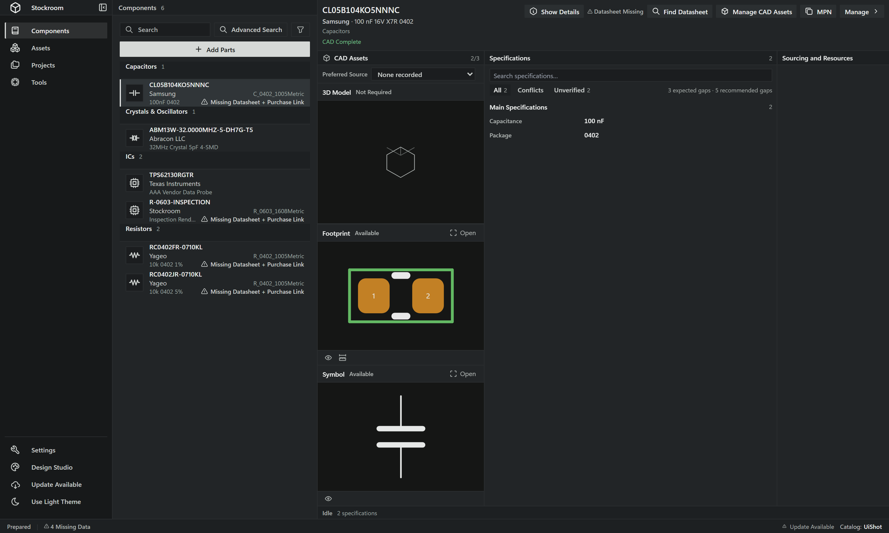
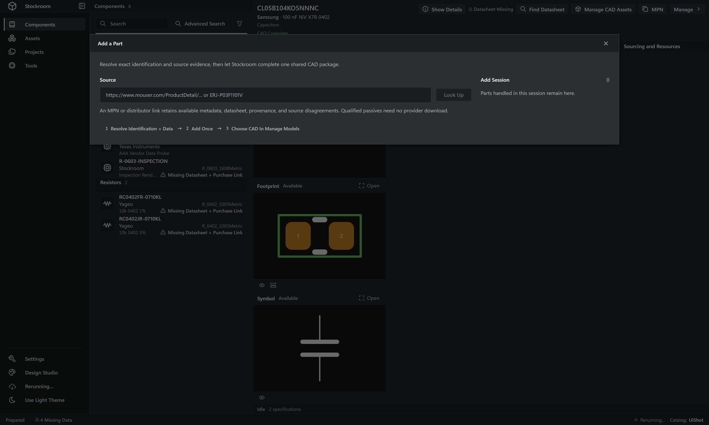
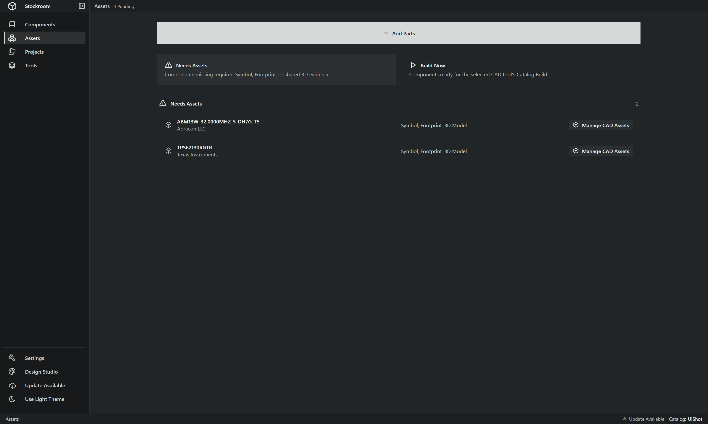
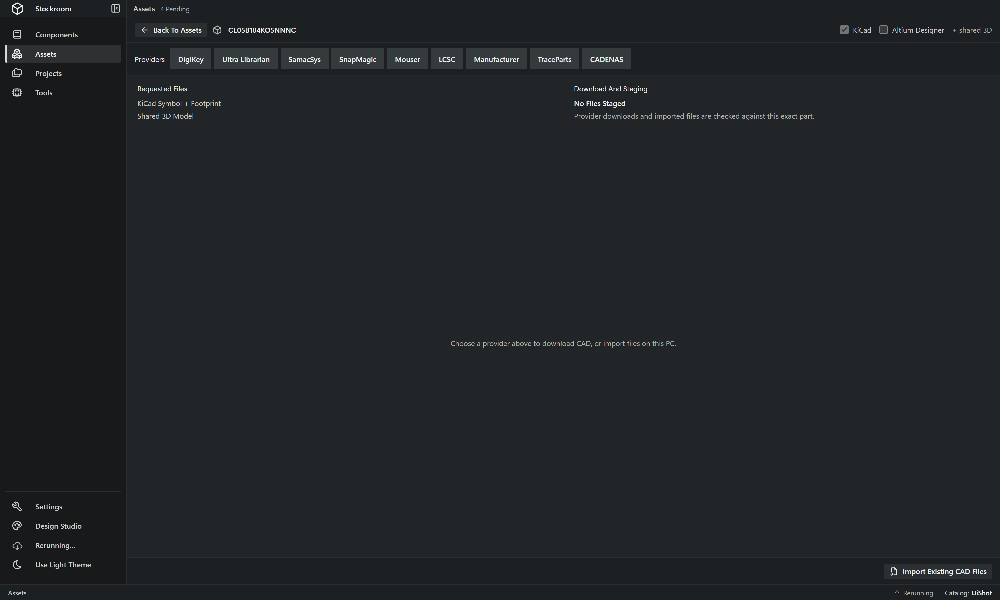
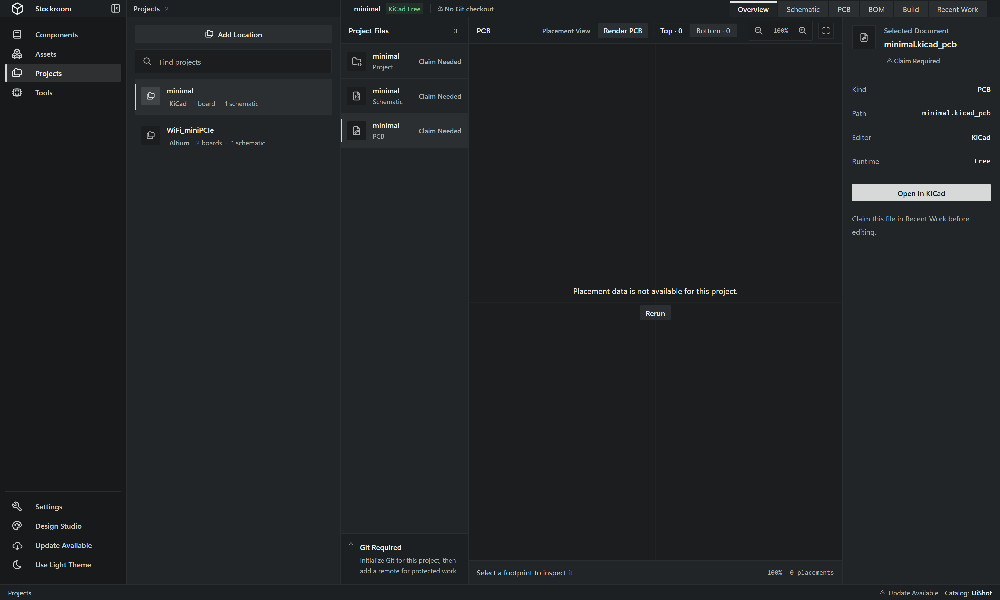
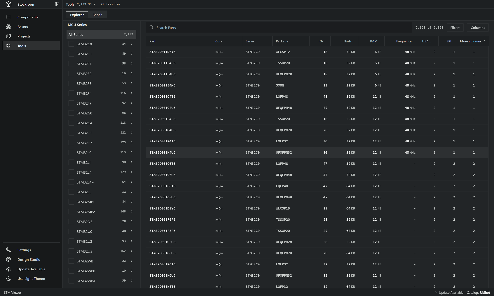
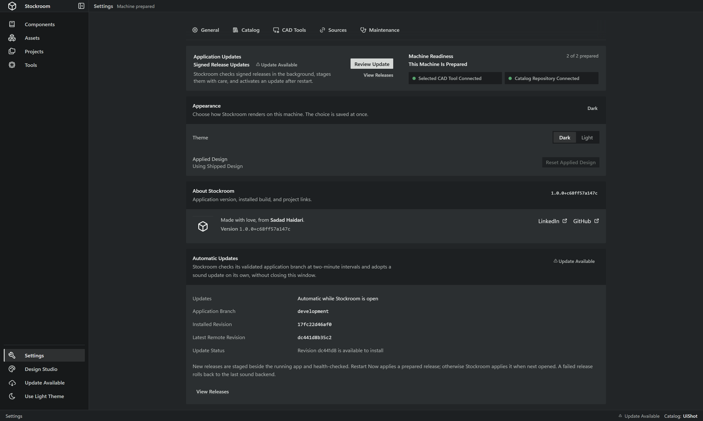
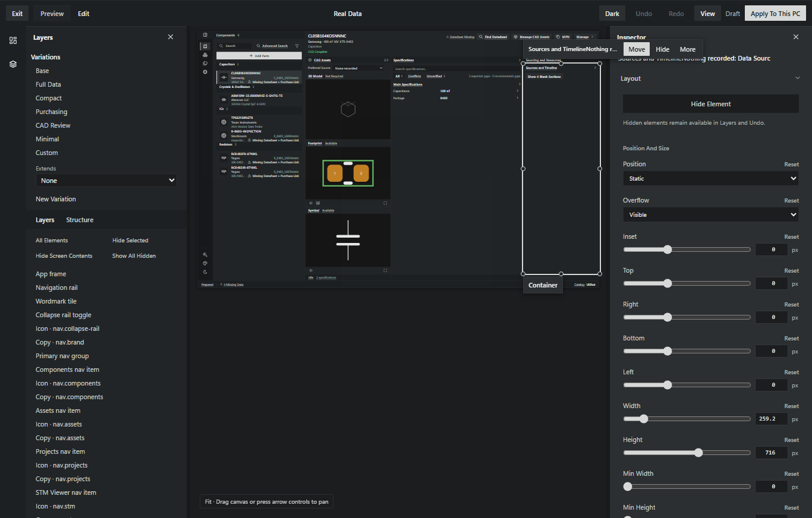

# Stockroom

Stockroom keeps electronic components, CAD files, datasheets, sourcing evidence, and PCB projects in one Windows app. Your component Catalog lives in its own Git repository, so you can use the same parts on another PC or share them with people who have repository access.

[Download Stockroom for Windows](https://sadadsh.github.io/stockroom/) and choose the portable EXE. Unzip it, then open `Stockroom.exe`.

## Start Here

1. Choose KiCad, Altium Designer, or both.
2. Sign in to GitHub and connect a Catalog repository.
3. Add a component by exact manufacturer part number or distributor link.
4. Download missing CAD files through **Manage CAD Assets**.
5. Open **Projects** to find local KiCad and Altium work and match its BOM to your Catalog.

Stockroom saves Catalog changes to Git. PCB project repositories stay separate.

## Components

The Components screen is the home for your Catalog. Search or filter the list on the left, then open a component to see its CAD, specifications, sourcing, documents, and history.

The first view stays compact. **Show Details** reveals missing fields and source evidence when you need them.



### Add A Part

Select **Add Parts**, paste an exact MPN or a distributor link, and choose **Look Up**. Stockroom checks Mouser first, DigiKey second, and an identity-matched manufacturer datasheet. It keeps sourced fields and reports gaps instead of creating fake values.

Review the result once, then add it to the Catalog. Parts that still need CAD appear in Assets.



## CAD Assets

Assets separates two jobs:

- **Needs Assets** lists components missing a required symbol, footprint, or shared 3D model.
- **Build Now** lists components ready for the selected CAD tool's generated Catalog.



Open **Manage CAD Assets** for a component, choose the EDAs you use, then pick a provider tab. The built-in browser behaves like a normal browser. Stockroom takes you to the part page and leaves sign-in, navigation, and the download button to you.

When a download lands, Stockroom checks it against the exact component. Proven files attach at once, the browser closes, and the component reports **CAD Ready** or names the files that were added. An ambiguous or mismatched package stays available for review. **Import Existing CAD Files** is the manual fallback.



## Projects

Projects finds KiCad and Altium projects through Windows Search. **Add Location** covers folders Windows has not indexed.

Select a project to inspect its schematic and PCB documents, render either EDA through the same Stockroom canvas, build a BOM, and match exact MPNs to the Catalog. A selector appears when a project contains several boards or schematic documents.

Stockroom keeps project Git history in the project repository. It keeps reusable components in the Catalog repository.



## STM32 Tools

Tools includes an STM32 Explorer and compatibility bench. Search 2,000-plus MCUs, filter by family and package, choose useful columns, inspect pins, and compare target requirements without leaving Stockroom.



## Settings

Settings owns five groups:

- **General**: updates, theme, applied design, and version details.
- **Catalog**: GitHub connection, Catalog checkout, sharing, and sync health.
- **CAD Tools**: KiCad and Altium setup and generated library paths.
- **Sources**: Mouser and DigiKey API configuration.
- **Maintenance**: health checks, rebuilds, recovery, and cleanup.

Stockroom checks signed GitHub releases while it runs. A healthy update stages beside the current runtime and activates after restart. The previous generation remains available for rollback.



## Design Studio

Design Studio edits Stockroom itself.

- **Preview** lets you use the app.
- **Edit** lets you select visible elements, move, resize, rotate, restyle, replace content or icons, change stacking order, and hide elements.
- **Draft** saves personal work without changing the ordinary app.
- **Apply To This PC** activates the design outside Design Studio.

Layers exposes hidden items and exact repeated occurrences. Grid snap, free movement, undo, and reset stay available from the editor. Hold `Ctrl+Shift` while launching Stockroom to bypass an applied design for recovery.



## Catalog Sharing

A Stockroom Catalog is an ordinary Git repository with one JSON record per component plus its managed documents and CAD files. Derived SQLite indexes and generated EDA outputs stay out of Git.

Give another person access to the Catalog repository, then let them connect it from Stockroom. Git history keeps earlier values, while Stockroom uses the newest accepted field edit. You do not need a Sync button during normal work.

## Download And Updates

The [Stockroom download page](https://sadadsh.github.io/stockroom/) offers two Windows channels:

- **Portable EXE**: unzip and open `Stockroom.exe`. This is the shortest path.
- **App Installer**: installs Stockroom into Windows and uses the same signed runtime.

Both channels use the same native WPF host, WebView2 interface, immutable packaged worker, CAD converter, and signed update feed. Microsoft Store distribution is optional and separate.

## Development

Stockroom uses a native .NET WPF host, a React and TypeScript interface, and a windowless FastAPI worker. Provider pages run in a separate native WebView2 surface. The Catalog uses Git for recovery and sharing.

Install Python 3.12+, [uv](https://docs.astral.sh/uv/), and Node 20+:

```powershell
uv sync
npm.cmd --prefix app/frontend ci
```

Start the isolated development app:

```powershell
powershell -ExecutionPolicy Bypass -File scripts\Start-Stockroom-Development.ps1
```

Run the completion gate:

```powershell
powershell -ExecutionPolicy Bypass -File scripts\Gates.ps1
```

The gate covers Python, TypeScript, React, native host, CAD converter, production build, and committed `frontend-dist` synchronization.

## Repository Map

```text
app/backend/stockroom/          FastAPI worker and domain code
app/desktop/                    Native Windows host and CAD converter
app/frontend/                   React and TypeScript source
app/frontend-dist/              Committed production interface
docs/                           Architecture and product decisions
packaging/                      Windows release and update tooling
scripts/                        Development and verification commands
tests/                          Backend and native tests
```

Read [CONTRIBUTING.md](CONTRIBUTING.md) before changing source. [docs/architecture.md](docs/architecture.md) explains module ownership, and [docs/adding-a-feature.md](docs/adding-a-feature.md) gives the shortest supported path for common changes.
