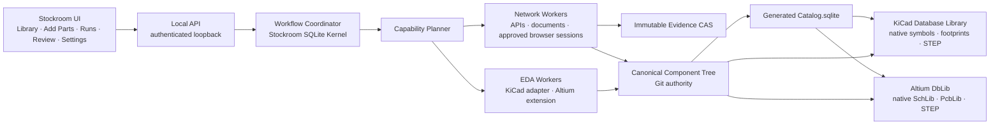
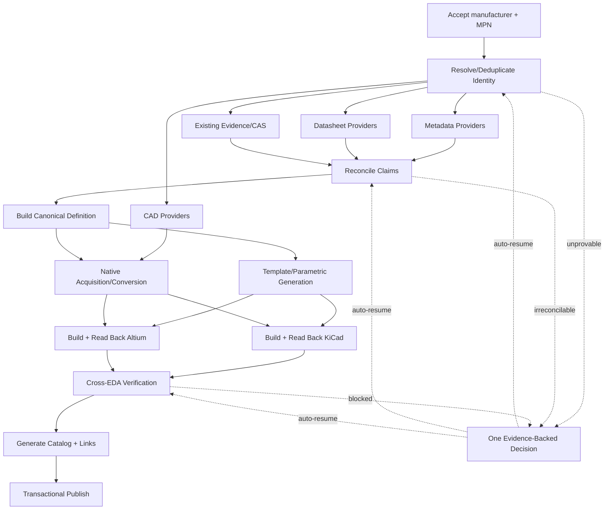
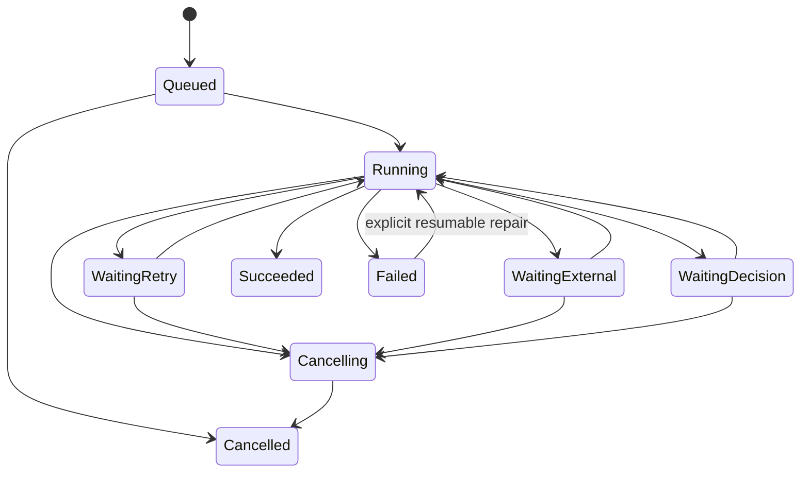

# Stockroom VNext Architecture

Status: accepted implementation contract
Scope: Windows-only, library-only vNext
Authority date: 2026-07-28

## Executive Decision

Stockroom vNext is a local-first component-library factory, not a collection of
forms and not a KiCad application with partial Altium support.

The owner submits one manufacturer part number or a list of up to thousands.
Stockroom then performs the work: exact identity resolution, metadata and
datasheet acquisition, immutable evidence capture, reconciliation, CAD
acquisition or generation, native KiCad and Altium projection, independent
validation, cross-EDA equivalence checking, database-library linking, and
transactional publication. These activities fan out concurrently where their
dependencies allow. A normal part requires no human interaction.

The architecture has six central decisions:

1. **One tool-neutral component is the authority.** KiCad and Altium are
   generated projections of the same versioned definition. Neither EDA owns the
   data model.
2. **Both EDAs consume one generated SQLite catalog through their supported
   database-library mechanisms.** Native symbols, footprints, and STEP models
   are still generated and verified for each tool. A single immutable component
   ID is the database key in both projections.
3. **A component is publishable only when its required KiCad and Altium
   representations both pass.** There is no partial green state, no
   “KiCad-complete,” and no passive shortcut. Passives receive explicit,
   verified bindings to shared templates in both tools.
4. **Use one app-owned durable workflow kernel instead of extending the
   in-memory job runner.** The implemented stdlib SQLite kernel is the
   authoritative baseline behind a Stockroom-owned interface. An external
   runtime may replace it only by winning the recovery/lifecycle/Windows
   qualification and completing a lossless one-engine migration. All payloads
   are validated JSON-only data, never Python pickle.
5. **Human review is exception-only.** If a fact cannot be proven, Stockroom
   presents one compact decision containing the competing evidence, the
   consequence of each choice, and a safe recommendation. The workflow resumes
   automatically after the decision.
6. **Updates are coherent and require no user restart ritual.** TUF-secured
   release sets, shadow-service handoff, and automatic host/window replacement
   keep one compatible installation while the visible session stays with the
   owner.

The current component library is intentionally empty. Historical records and
assets remain recoverable from Git, but none are silently promoted into vNext.
The Projects frontend is removed for this phase. Project management, board
mutation, and any feature that cannot be supported equivalently in KiCad and
Altium are outside this architecture.

## Product Contract

### Nonnegotiable invariants

- One part and 1,000 parts use the same intake, planner, task graph, verification
  rules, and publication code.
- The default workflow is zero-touch. A user never fills fields one at a time.
- A submitted part autonomously fans out metadata, datasheet, source-evidence,
  reconciliation, CAD, generation/conversion, EDA verification, and linking
  activities.
- Manufacturer plus exact MPN is the identity. Search rank, description
  similarity, package similarity, and distributor suggestions are never
  identity.
- Every source response and downloaded file is content-addressed and immutable.
  Derived claims can be recomputed without altering evidence.
- Every value shown as authoritative has a source locator and derivation rule.
- A retry is durable and classified. A process restart cannot forget queued,
  running, waiting, or completed work.
- Every external side effect is idempotent because durable execution is
  at-least-once at the step boundary.
- A provider that is unavailable, rate-limited, authenticated incorrectly, or
  missing a format does not stall unrelated work.
- Both EDA representations are generated from or reconciled against one
  canonical definition.
- A publish transaction contains no unverified artifact and never exposes a
  half-updated component.
- Presence, verification, provenance, and readiness are separate concepts.
- Readiness is computed from required outcomes. It is never a stored verdict and
  never inferred from an unweighted percentage of implementation tasks.
- No secret, session cookie, token, or password is stored in Git, JSON settings,
  logs, evidence manifests, crash reports, or workflow arguments.
- Failed work remains inspectable and resumable. It never masquerades as
  success.
- The UI remains responsive while the worker continues after the window closes.
- Stockroom updates as one signed coherent release. The visible session adopts
  frontend, backend, schema, host, and WebView runtime changes through automatic
  health-checked handoffs; the owner never closes/reopens it to see a change.
- Every supported installation is a continuously converging replica, not an
  independently maintained deployment. On service start and on a bounded
  background schedule it discovers, verifies, stages, and activates the latest
  healthy release automatically. There is no update channel, opt-in toggle,
  snooze button, hand-run Git operation, or per-device deploy ritual.

### In scope

- Exact single and bulk part intake.
- Electrical components and mechanical library items representable in both
  KiCad and Altium.
- Metadata, sourcing facts, datasheets, symbols, footprints, and STEP models.
- Shared parametric templates and component-specific representations.
- Native KiCad and native Altium library outputs.
- A common SQLite component catalog with deterministic KiCad and Altium
  database-library projections.
- Provider adapters, policy, health, fallback, rate limiting, and circuit
  breaking.
- Immutable provenance, verification evidence, exception review, and Git-backed
  publication.
- Windows credentials, packaging, updates, background operation, and support
  diagnostics.

### Explicitly out of scope

- The Projects frontend and project workflows.
- KiCad-only board or schematic mutation.
- Altium-only project, Workspace, simulation, variant, or release features.
- Features that cannot be represented and verified in both EDAs.
- Automated bypass of CAPTCHA, anti-bot protections, paywalls, licenses, or
  provider terms.
- Cloud infrastructure as a requirement for normal local use.
- Automatic promotion of any legacy component or CAD asset.

## System Shape



### Windows process topology

`Stockroom Service` is a per-user background process. It owns the local API,
workflow coordinator, provider rate limits, runtime databases, and publication
mutex. It starts with Windows after installation and continues working when the
UI closes. It does not run as an administrator and does not require a
machine-wide Windows service.

The React UI is rendered by WebView2 inside a replaceable Windows host. Closing
the host does not cancel work. Reopening it replays durable run events and
reconnects to current progress.

Work is isolated into resource-specific workers:

- **I/O workers** use async HTTP and bounded concurrency.
- **Browser workers** use one dedicated provider profile per provider and never
  reuse the user's normal browser profile.
- **CPU workers** parse, normalize, hash, render, and compare artifacts in
  subprocesses with memory and time limits.
- **KiCad worker** discovers supported installed versions and runs the
  version-specific adapter.
- **Altium bridge** is a managed C# extension running inside licensed Altium
  Designer. It communicates with Stockroom over a per-user authenticated named
  pipe. Its queue has concurrency one unless a tested Altium version proves a
  higher safe limit.
- **Publisher** is the only process allowed to mutate the library Git working
  tree.

Workers receive IDs and content hashes, not arbitrary executable code or
secrets. Every worker result is validated at the API boundary.

Production IPC is explicit. The service binds only IPv4/IPv6 loopback on an
OS-assigned port and exposes its port plus one-time bootstrap nonce through a
named pipe ACL'd to the current Windows SID. The host exchanges that nonce for
a 256-bit session token and injects the authorization header into approved
WebView2 requests; React never receives the token. The token stays in native
process memory, rotates when either process restarts, and never appears in a
URL, command line, environment variable, browser storage, or log. The service
also enforces the expected `Host`, `Origin`, content type, request size, and API
schema. Live events use an authenticated fetch stream so an `EventSource` query
token is unnecessary.

### Desktop host and rendering decision

Retain the existing React interface and WebView2 Evergreen rendering layer.
Do not rewrite the product UI into native controls and do not select a host
framework by reputation. The host owns only Windows lifecycle concerns:

- one signed single-instance application window,
- startup and health supervision of the per-user Stockroom service,
- an ephemeral authenticated loopback session,
- WebView2 environment and user-data-folder lifecycle,
- approved navigation, downloads, new windows, and external-link handling,
- DPI, theme, accessibility, notifications, protocol activation, and update
  restart,
- diagnostic access in development and test builds, disabled in production.

The frontend speaks the same versioned local API regardless of host. It never
uses a framework-specific JavaScript-to-native bridge for domain operations.
That keeps the host replaceable and prevents a future shell change from
rewriting workflows.

WebView2 is a deliberate rendering choice, not an assumption that its current
Python host is permanent. Microsoft recommends the Evergreen distribution,
which is shared and automatically updated. It is included with Windows 11 and
already present on the vast majority of eligible Windows 10 machines. The
installer must still detect and bootstrap the runtime when absent; “normally
installed” is not an installation invariant.

Before Phase 6, build production-shaped thin-host prototypes around the same
signed frontend bundle and mock service:

| Candidate | What it proves | Known cost or risk | Provisional status |
| --- | --- | --- | --- |
| Current pywebview/WinForms host, forced to `edgechromium` | Lowest migration cost and direct comparison to current behavior | Python/.NET interop and host lifecycle are less explicit; pywebview can otherwise fall back to deprecated MSHTML | Baseline only; refuse renderer fallback |
| Minimal C# WPF + WebView2 host | Mature .NET desktop lifecycle, direct CoreWebView2 failure APIs, low shell complexity, and no Windows App SDK servicing layer | Older native shell framework; intentionally limited to a thin host | **Preferred and sole first challenger** |
| Minimal C# WinUI 3 + WebView2 host | Microsoft's current Windows UI stack, explicit process/window lifecycle, native MSIX integration | Adds the Windows App SDK deployment and servicing layer without a current benefit for Stockroom's deliberately thin shell | Contingency only if substantial native UI or custom chrome enters scope |
| Tauri 2 + WebView2 with packaged Python sidecar | Strong host permissions and explicit sidecar packaging | Still uses WebView2, while adding Rust, native build tools, a second updater/installer model, and sidecar protocol work | Select only on measured superiority |
| Electron | Bundled Chromium and mature browser automation | Bundles Chromium and Node, materially increases package/memory/security servicing, and has an eight-week major lifecycle with only three stable lines supported | Reject unless WebView2 fails a hard product gate |

The current development build provides a preliminary baseline, not a selection
result. Its steady inclusive pywebview/WebView2 process tree measured about
530.7 MiB working set and 376.9 MiB private bytes: 6.1 MiB launcher, 136.5 MiB
Python backend/host, and about 388 MiB across six WebView2 children. One
cold-ish development launch reached CDP readiness in roughly 9–12 seconds. It
shut down cleanly and real light/dark screenshots rendered correctly. Those
measurements do not attribute cost to pywebview versus WebView2 and are not
comparable to a packaged, optimized build; they establish the baseline the
bakeoff must explain and improve. Repeating those startup and private-memory
results in the production-shaped bakeoff would fail the gates below.

The preregistered documentary score before prototype qualification is WPF 86,
WinUI 3 82, Tauri 75, Electron 68, and current pywebview/WinForms 54 out of
100. WPF leads because both C# choices expose the required WebView2 lifecycle
and recovery APIs, while this product currently gains nothing from WinUI 3's
additional deployment/servicing layer. This score does not select WPF:
pywebview remains the transition baseline until the packaged WPF prototype
passes every hard gate, including browser-process recreation that the first
quick proof did not yet pass.

The bakeoff is automated on the supported Windows baseline and a clean Windows
account. Measure the complete process tree, not only the parent process, over at
least 30 cold and 30 warm starts. Every candidate must pass these hard gates:

1. A cold host start with an already healthy service reaches an interactive
   shell in at most 2 seconds p95; warm UI reopen is at most 1 second p95. First
   post-install launch shows the same shell within 2 seconds while service
   provisioning reports honest background progress.
2. The inclusive UI host/WebView process tree is at most 350 MiB private
   working set idle and 600 MiB while scrolling and receiving events for a
   1,000-part run.
3. UI crash, service crash, service upgrade, sleep/resume, Windows sign-out,
   and forced process termination recover without a lost job, duplicate
   service, orphan sidecar, stale port, or false-ready screen.
4. Playwright or raw CDP can observe and test the packaged development build,
   while production builds expose no remote-debugging endpoint.
5. Signed per-user install, update, failed-update rollback, uninstall, and
   WebView2 bootstrap work without a shell or administrator access. Uninstall
   preserves canonical library data unless the owner explicitly requests its
   removal.
6. Light/dark/high-contrast themes, keyboard navigation, screen-reader labels,
   100/125/150/200-percent DPI, multi-monitor movement, minimize/restore, and
   close/reopen pass on real Windows.
7. Navigation is allowlisted to packaged UI content and the authenticated
   loopback origin. External links open in the default browser; arbitrary
   downloads, popups, local-file access, and untrusted native bridge calls are
   blocked.
8. The app remains responsive at 60 fps for the virtualized 1,000-row run while
   the service streams events and an EDA worker is busy.
9. While a form is open and a 1,000-part run is active, install a signed
   frontend, backend/schema, and host update in sequence. The same visible
   session adopts each tier automatically, durable work is neither lost nor
   duplicated, and injected failure rolls back to one coherent release without
   a user close/reopen action.

Among passing candidates, use a preregistered weighted score: reliability and
recovery 30%, packaged observability 20%, installation and update behavior 15%,
startup and memory 15%, Windows UX/accessibility 10%, and maintenance/toolchain
burden 10%. Keep the current host if no challenger beats it by at least 10
points. Record raw measurements, prototype commits, package sizes, toolchain
versions, failures, and the signed decision in an accepted architecture
decision. Delete losing prototype code after preserving the evidence.

## Adopt Versus Build

The old in-memory `ThreadPool`/SSE runner is not a vNext foundation. It loses
the queue, current state, and recovery position when the process exits.

| Candidate | Useful properties | Disqualifying gap or cost | Decision |
| --- | --- | --- | --- |
| Current runner | Already integrated; simple | No durable queue, restart recovery, event replay, workflow versioning, or durable retry | Remove behind compatibility seam |
| Stockroom stdlib SQLite kernel | Already implemented in isolation; exact domain schema; WAL/FULL durability; strict JSON; migrations; DAG fan-out/join; leases; retry; pause/cancel; identity/safety decisions; monotonic events; atomic publication receipts; same graph tested for 1 and 1,000 items | Still needs production adapters, resource queues/rate limits, lease heartbeat/fencing, workflow-code versions, retention, and randomized kill qualification | **Authoritative vNext baseline** |
| Celery | Mature distributed queue | Windows is not a supported worker platform; requires a broker; workflow state still belongs elsewhere | Reject |
| Huey 3.3 + SQLite | Lightweight, priorities, groups/chords, retry/backoff, embedded consumer | Its official consumer documentation states that it does not guarantee at-least-once delivery and abruptly interrupted running tasks are lost; default serialization is pickle | Reject as authoritative runtime |
| APScheduler | Persistent schedules and jobs | A scheduler is not a durable component DAG or evidence ledger; application still owns recovery, dependencies, and side-effect idempotency | Use only if future calendar scheduling needs it |
| Prefect 3 | Workflows, retries, UI, local SQLite option | Adds its own server and UI; documented high-throughput/multiworker deployment moves to PostgreSQL and Redis | Reject for the desktop core |
| Temporal | Excellent durable execution | Requires an orchestration service and operational lifecycle that are disproportionate for a one-user Windows desktop | Reject for local vNext |
| DBOS + SQLite | Embedded durable workflows, child fan-out, queues, priorities, rate limits, retries, waits, recovery, events, and code versions | Adds a young dependency and private schema; SQLite is not its recommended production database; Python defaults to pickle unless a custom serializer is installed; must beat code that now exists | Challenger/control only |

`WorkflowStore` is the implemented first slice of
`SqliteWorkflowRuntime`. Put the `WorkflowRuntime` port in front of it before
integrating domain adapters; domain code must not depend on its SQL schema.
Complete the missing production capabilities as numbered migrations and narrow
runtime services, not as another queue.

The current targeted store suite passes 11 tests, including identical 1/1,000
graphs, 8,000 staged activities, concurrent no-double-claim behavior,
crash/reopen lease recovery, durable retry, one identity decision and resume,
pause/cancel, atomic publish receipt, WAL/FULL settings, and strict JSON. That
is strong baseline evidence, not the randomized production qualification below.

Exactly one engine may be authoritative in a release. The legacy `JobRunner`
may remain temporarily behind old API routes during cutover, but it cannot
enqueue vNext work. DBOS may be exercised in a benchmark/test process, but it
cannot dequeue, checkpoint, dual-write, or publish production jobs while the
SQLite kernel is active. There is no “DBOS plus our lease table” architecture.

### Mandatory runtime qualification

The app-owned kernel must pass all of the following before product adapters
depend on it. Any proposed replacement runs the identical black-box suite:

1. Enqueue 1,000 component workflows with at least eight child activities each,
   enforce queue concurrency and rate limits, and complete without a lost child.
2. Kill the coordinator at randomized instruction boundaries at least 100
   times. After restart, every workflow is either complete, waiting with a
   reason, or retryable; none disappears.
3. Kill a worker after an external side effect but before its checkpoint. The
   retry observes the idempotency key and does not duplicate evidence, a Git
   publish, or an Altium/KiCad artifact.
4. Cancel queued, running, waiting, and retry-delayed workflows. Cancellation
   is durable and no component publishes after cancellation.
5. Wait for a human decision, close Stockroom, restart Windows, submit the
   decision, and prove automatic resumption from the waiting point.
6. Start workflows on runtime schema N, migrate to N+1, and recover them under
   an explicitly compatible application version. Incompatible workflow code is
   drained or retained side by side, never replayed against a different graph.
7. Prove interactive priority and weighted fairness: one newly submitted part
   begins within two seconds while a 1,000-part run is active.
8. Prove bounded memory, event retention, database checkpointing, database
   integrity checks, and recovery of a copied runtime database.
9. Exercise every argument, result, event, decision, receipt, and error path;
   inspect storage and prove every application payload is schema-valid JSON and
   no pickle or credential bytes exist. Inject pickle-shaped and malformed
   payload bytes and prove they are quarantined without deserialization.

### External-runtime replacement gate

DBOS is not recommended for production now. It remains a useful control because
its feature set reveals gaps the Stockroom kernel must not hand-wave. Reconsider
it only after the app-owned kernel passes the suite above and only if a pinned
DBOS adapter:

1. Passes every correctness gate with the required global fail-closed JSON
   serializer plus `WorkflowSerializationFormat.PORTABLE`; Python step outputs
   otherwise use native pickle even when workflows are portable.
2. Demonstrates simpler recovery and version lifecycle on real Windows, not
   merely fewer lines in a demo.
3. Reduces measured packaging/update complexity without increasing cold start,
   working set, database latency, transitive vulnerability surface, or failure
   modes.
4. Scores at least 15 points higher in a preregistered comparison: recovery and
   lifecycle 30%, Windows packaging/update 25%, workflow/schema upgrades 20%,
   performance/resources 15%, and maintenance/supply chain 10%.
5. Ships a tested bidirectional migration for every nonterminal state, stable
   ID, event sequence, decision, attempt, and publication receipt.

A replacement release automatically stops intake for the brief cutover,
checkpoints and stops all claims, exports a versioned canonical
`Workflow Transfer.jsonl`, imports a shadow database, and compares every row and
derived status. Fault-injected canaries run on a copy. Only then may one atomic
release-manifest pointer select the new `runtime_kind`; the old database becomes
read-only. Rollback must convert all work created after cutover back to the old
engine without loss. If bidirectional conversion cannot be proven, the
candidate is ineligible. Dual-write and two active dequeuers are forbidden.

## Authority and Storage

### Authority matrix

| Data | Authority | Rebuildable | Git tracked |
| --- | --- | ---: | ---: |
| Manufacturer identities and aliases | Canonical JSON | No | Yes |
| Component identity and accepted claims | Canonical JSON | No | Yes |
| Tool-neutral representation definition | Canonical JSON | No | Yes |
| Human decisions and explicit overrides | Canonical JSON event | No | Yes |
| Portable evidence manifests | Append-only JSON | No | Yes |
| Portable evidence bytes | Content-addressed objects | No for historical proof | Yes, LFS when appropriate |
| Restricted evidence bytes | Local content-addressed store | No on that machine | No; manifest records disposition |
| KiCad and Altium native assets | Deterministic projection | Yes | Yes, LFS for binary/large files |
| Shared `Catalog.sqlite` | Local transactional projection | Yes | No |
| Catalog schema, projection recipe, and semantic digest | Canonical source/proof | Yes | Yes |
| Verification reports | Deterministic facts for an artifact hash | Yes but expensive | Yes |
| Search/index database | Projection | Yes | No |
| Workflow/checkpoint database | Runtime state | Recoverable by reconciliation | No |
| Logs and traces | Runtime diagnostics | No | No |
| Credentials | Windows Credential Manager | No | Never |

Git is the recovery mechanism for the component library. vNext does not create
a second manually managed recovery vault. Runtime databases receive automatic,
short-lived migration backups because they are active database files, not
library authority; they may be discarded after integrity and recovery checks.

### Library tree

```text
Stockroom Library/
├── Library.yaml
├── Manufacturers/
│   └── <Manufacturer ID>/
│       └── Manufacturer.json
├── Components/
│   └── <Component ID>/
│       ├── Component.json
│       ├── Claims.json
│       ├── Definition.json
│       ├── Artifact Set.json
│       └── Verification.json
├── Templates/
│   ├── Symbols/
│   ├── Footprints/
│   └── Models/
├── Evidence/
│   ├── Manifests/
│   │   └── <Attempt ULID>.json
│   └── Objects/
│       └── SHA256/
│           └── <First Two Hex>/<Remaining Hex>
├── Catalog/
│   ├── Catalog.sqlite              # generated locally; Git ignored
│   ├── Catalog Schema.sql
│   └── Catalog Digest.json
├── EDA/
│   ├── KiCad/
│   │   ├── Stockroom.kicad_dbl
│   │   ├── Symbols/
│   │   ├── Footprints/
│   │   │   └── Stockroom.pretty/
│   │   └── Models/
│   └── Altium/
│       ├── Stockroom.DbLib
│       ├── Symbols/
│       ├── Footprints/
│       ├── Models/
│       └── Compiled/
├── Policies/
│   ├── Providers.yaml
│   ├── Reconciliation.yaml
│   └── Verification.yaml
└── Schemas/
    └── <Versioned JSON Schemas>
```

Human-facing names are Title Case. Required host contracts and EDA extensions
retain their exact spelling. IDs are opaque lowercase machine identifiers and
never contain manufacturer or MPN text.

Portable evidence is stored under its SHA-256 digest using create-if-absent
semantics. A write streams to a same-volume temporary file, verifies size and
digest, flushes it, and atomically renames it. An existing object is reused only
after its bytes match the expected digest. No code path edits an evidence
object.

Provider licensing policy decides evidence disposition:

- `git_lfs`: bytes and manifest are portable with the library.
- `git_plain`: small response bytes and manifest are portable.
- `local_cas`: manifest and digest are portable; bytes stay in
  `%LOCALAPPDATA%\Stockroom\Evidence`.
- `manifest_only`: only request/response facts permitted by policy are retained.
- `forbidden`: provider cannot be used for that requested output.

A component is not described as reproducible on another machine if required
evidence is `local_cas` or `manifest_only` and unavailable there.

### Runtime storage

```text
%LOCALAPPDATA%\Stockroom\
├── Runtime\
│   ├── Workflows.sqlite
│   ├── Control.sqlite
│   ├── Index.sqlite
│   ├── Staging\
│   └── Logs\
├── Evidence\
├── Browser Profiles\
├── Updates\
└── Support\
```

All runtime SQLite files live on a local NTFS volume, not a network share,
OneDrive, or the Git library. Application-owned SQLite databases use WAL mode,
foreign keys, a bounded busy timeout, explicit checkpoints, and `synchronous =
FULL` for authoritative runtime transitions. Long readers are prohibited.

`Control.sqlite` contains Stockroom's append-only run event ledger and UI
projection. `Workflows.sqlite` is owned by the workflow runtime. `Index.sqlite`
is fully derived from the Git tree and generated catalog. These boundaries
prevent an orchestration dependency's private schema from becoming the product
model.

## Exact Identity

An orderable manufacturer part is uniquely identified by:

```text
(Manufacturer ID, Manufacturer-Canonical MPN)
```

MPN alone is not globally unique. Distributor SKU, provider result ID, package,
description, or normalized search text is never an identity key.

### Identity rules

- Preserve the user's input as `mpn_verbatim`.
- Obtain `mpn_canonical` from manufacturer evidence or an exact provider record.
- Preserve case, punctuation, suffixes, and internal whitespace unless a
  manufacturer-specific, versioned identity rule proves equivalence.
- Manufacturer aliases resolve through a committed manufacturer registry.
- Fuzzy matches can discover candidates but can never cross the identity gate.
- A package or temperature-code suffix is part of the MPN unless manufacturer
  evidence says otherwise.
- If two exact authorities disagree, the component waits for one compact
  identity decision; no downstream artifact is published.
- Component and manufacturer IDs are deterministic full-digest identities so
  independent devices converge on the same path.

```text
manufacturer_digest =
  SHA-256("stockroom.manufacturer.v1\0" + authoritative_manufacturer_key)

component_digest =
  SHA-256("stockroom.component.v1\0" + manufacturer_digest + "\0" + mpn_canonical)

Manufacturer ID = "mfr_" + Base32(manufacturer_digest)
Component ID    = "cmp_" + Base32(component_digest)
```

The full digest is stored and verified; shortened IDs are not used. A legal-name
change creates an alias, not a new manufacturer. A true manufacturer merger is
an explicit identity migration with redirects and collision checks.

### Component schema example

```json
{
  "$schema": "https://stockroom.local/schemas/component/1",
  "component_id": "cmp_6h5t4...",
  "identity_digest": "sha256:...",
  "identity": {
    "manufacturer_id": "mfr_c2q7...",
    "manufacturer_name": "Example Semiconductor",
    "mpn_verbatim": "ABC1234-Q1",
    "mpn_canonical": "ABC1234-Q1",
    "identity_evidence": [
      "evidence:01K...#identity"
    ]
  },
  "kind": "electrical",
  "claims_ref": "Claims.json",
  "definition_ref": "Definition.json",
  "artifact_set_ref": "Artifact Set.json",
  "extra": {}
}
```

Readiness, trust, completeness, and workflow status are deliberately absent.
They are computed from the referenced facts and current policy.

## Claims, Evidence, and Reconciliation

### Evidence attempt

Each provider interaction creates one immutable attempt manifest, including
failed and empty outcomes:

```json
{
  "$schema": "https://stockroom.local/schemas/evidence-attempt/1",
  "attempt_id": "01K...",
  "component_id": "cmp_6h5t4...",
  "provider": "provider-key",
  "adapter_version": "3.1.0",
  "policy_version": "sha256:...",
  "started_at": "2026-07-28T05:14:22Z",
  "completed_at": "2026-07-28T05:14:24Z",
  "request": {
    "operation": "lookup_exact",
    "identity_digest": "sha256:...",
    "formats": ["metadata", "datasheet", "kicad", "altium", "step"]
  },
  "identity_match": {
    "kind": "exact_manufacturer_mpn",
    "returned_manufacturer": "Example Semiconductor",
    "returned_mpn": "ABC1234-Q1",
    "locator": "$.manufacturerPartNumber"
  },
  "objects": [
    {
      "sha256": "...",
      "bytes": 48172,
      "media_type": "application/json",
      "disposition": "git_plain"
    }
  ],
  "outcome": "succeeded",
  "failure": null,
  "sanitization": {
    "credentials_removed": true,
    "headers_retained": ["content-type", "etag", "last-modified"]
  }
}
```

Retries create new attempts linked by `retry_of`; they never replace the old
manifest. HTTP redirects, final URL, ETag, content type, byte length, provider
artifact identifiers, tool versions, and extractor versions are recorded when
permitted. Authorization, cookies, query secrets, and credential-bearing
headers are removed before persistence.

### Claim model

`Claims.json` stores candidates and the rule-selected value separately:

```json
{
  "$schema": "https://stockroom.local/schemas/claims/1",
  "component_id": "cmp_6h5t4...",
  "claims": {
    "package.case": {
      "candidates": [
        {
          "value": "QFN-16",
          "evidence": "evidence:01K...#object/0",
          "locator": "$.package",
          "extractor": "provider-key@3.1.0"
        },
        {
          "value": "VQFN-16",
          "evidence": "evidence:01J...#page/42/table/1/row/2",
          "locator": "datasheet page 42"
        }
      ],
      "selection": {
        "value": "VQFN-16",
        "rule": "manufacturer_datasheet_over_distributor@1",
        "inputs_digest": "sha256:..."
      }
    }
  }
}
```

Confidence percentages are not authority. Selection is based on explicit,
reviewable source precedence and reconciliation rules. The system records
disagreement rather than averaging strings.

### Reconciliation order

Default authority order for a manufacturer fact is:

1. Current manufacturer datasheet or manufacturer machine-readable record.
2. Exact manufacturer-authorized data feed.
3. Two agreeing exact distributor records.
4. One exact distributor record.
5. CAD provider metadata, used only for acquisition planning.
6. Inference, never authoritative without an applicable accepted template or
   human decision.

Rules are field-specific. A distributor may be authoritative for orderable SKU
and stock while the datasheet is authoritative for pinout and package
dimensions.

## Tool-Neutral Representation

`Definition.json` is a versioned intermediate representation restricted to the
intersection Stockroom can generate and verify in both tools.

All geometry uses integers:

- Distances: nanometers.
- Angles: microdegrees.
- Ratios/scales: rational numerator and denominator.
- Pin and pad identifiers: exact strings.
- Units: explicit UCUM-compatible unit keys for metadata.

```json
{
  "$schema": "https://stockroom.local/schemas/definition/1",
  "component_id": "cmp_6h5t4...",
  "metadata": {
    "name": "Example 3 A Buck Regulator",
    "description": "Synchronous step-down converter",
    "category": "Power Management",
    "datasheet": {
      "sha256": "...",
      "source": "evidence:01K..."
    }
  },
  "representation": {
    "symbol": {
      "units": [
        {
          "unit": "A",
          "pins": [
            {
              "number": "1",
              "name": "VIN",
              "electrical_type": "power_in",
              "position_nm": [0, 2540000],
              "orientation_udeg": 0,
              "length_nm": 2540000,
              "visible": true
            }
          ],
          "graphics": []
        }
      ]
    },
    "footprint": {
      "pads": [
        {
          "number": "1",
          "technology": "smd",
          "shape": "roundrect",
          "position_nm": [-1500000, -1500000],
          "size_nm": [500000, 900000],
          "layers": ["top_copper", "top_mask", "top_paste"]
        }
      ],
      "graphics": [],
      "courtyard": [],
      "assembly": []
    },
    "model": {
      "format": "step",
      "sha256": "...",
      "transform": {
        "translate_nm": [0, 0, 0],
        "rotate_udeg": [0, 0, 0],
        "scale": [[1, 1], [1, 1], [1, 1]]
      }
    }
  },
  "template_bindings": [],
  "derivation": {
    "inputs": ["Claims.json#sha256:..."],
    "ruleset": "definition@1",
    "generator": "stockroom@..."
  }
}
```

### Common v1 capability

| Domain | Supported in v1 |
| --- | --- |
| Component data | Manufacturer, exact MPN, description, category, value, typed parameters, datasheet, lifecycle and sourcing facts |
| Symbol | Multi-unit symbols; exact pin name/number/type/visibility; lines, arcs, circles, rectangles, polygons, and text that map losslessly in both |
| Footprint | SMD and through-hole pads in the agreed common shape set; copper/mask/paste; silk, assembly/fabrication, courtyard, origin, and polarity marks |
| 3D | STEP model plus explicit translation, rotation, and scale |
| Linking | Stable database key, symbol reference, footprint reference, model reference, and mapped parameters |
| Templates | Versioned shared symbol, footprint, and model templates with component-specific parameter bindings |

Unsupported tool-specific constructs cause a structured
`unsupported_common_capability` result. They are not silently dropped. A
future capability enters the product only after both generators, both readers,
and cross-EDA tests exist.

### Passives and shared templates

“Passives need nothing” is abolished.

Every electrical component, including a resistor or capacitor, must have:

- an explicit symbol-template binding,
- an explicit footprint-template binding,
- an explicit model-template binding when the active policy requires 3D,
- native KiCad references,
- native Altium references,
- a verified parameter set,
- a verification report proving that both projections resolve.

A 10 kΩ 0402 resistor may share geometry with thousands of parts, but its
component entry explicitly binds:

```json
{
  "template_bindings": [
    {
      "role": "symbol",
      "template_id": "tpl_resistor_iec",
      "template_digest": "sha256:...",
      "parameters": {}
    },
    {
      "role": "footprint",
      "template_id": "tpl_r_0402_1005_metric_nominal",
      "template_digest": "sha256:...",
      "parameters": {
        "density": "nominal"
      }
    },
    {
      "role": "model",
      "template_id": "tpl_chip_0402",
      "template_digest": "sha256:...",
      "parameters": {
        "body_color": "neutral"
      }
    }
  ]
}
```

Changing a template creates a new digest and re-verifies every binding. It does
not mutate historical verification evidence.

## Shared Catalog and EDA Projections

`Catalog.sqlite` is a semantically deterministic local projection of canonical
components. It contains no unaccepted claim and no workflow status. Stockroom
is its only writer; KiCad and Altium open it read-only. The binary database and
its WAL/SHM files are Git ignored because SQLite page layout and live WAL state
are not source authority. `Catalog Schema.sql`, the projection code, canonical
JSON, and `Catalog Digest.json` are tracked and reproduce it.

The core table uses `Component ID` as its primary key and includes:

- manufacturer identity and display name,
- exact MPN,
- typed common parameters,
- datasheet path and digest,
- KiCad symbol/footprint/model references,
- Altium library/footprint/model references,
- definition and artifact-set digests,
- current verification manifest digest.

The generated `Catalog Digest.json` contains a canonical, sorted row digest and
catalog revision so semantic equality can be checked independently of SQLite
page layout and live connection state.

### KiCad projection

KiCad 10 database libraries are ODBC-backed, reference symbols and footprints
in other libraries, and can use SQLite. Stockroom generates:

- `Stockroom.kicad_dbl` with `globally_unique_keys: true`;
- one database sublibrary backed by the generated component table;
- an unpacked or deterministically packed symbol library;
- `Stockroom.pretty`;
- STEP models;
- a machine-local connection projection containing the installed x64 SQLite
  ODBC driver and absolute catalog path.

The globally unique database key is the Component ID. Moving a component
between display categories therefore does not change its placed-library link.
Credentials are blank because the local catalog is read-only and contains no
secrets.

KiCad's own documentation says database libraries do not contain symbol or
footprint definitions: they link database records to native libraries. That is
the exact vNext split. The catalog is common component data; native files are
EDA projections.

### Altium projection

Altium DbLib supports an ODBC data source and maps database columns to
`[Library Ref]`, `[Library Path]`, `[Footprint Ref]`, `[Footprint Path]`, and
other parameters. Stockroom generates:

- `Stockroom.DbLib`;
- sharded native `.SchLib` and `.PcbLib` sources;
- STEP models embedded or referenced through the generated PcbLib as required;
- a machine-local x64 ODBC connection projection;
- optional compiled `.IntLib` artifacts for offline distribution and an
  additional integrity check.

The primary live source is the DbLib so KiCad and Altium both read the same
catalog data. The Altium extension owns generation, readback, compilation, and
semantic report export. It is built with the official managed .NET SDK rather
than UI-driving dialogs or writing proprietary binary formats directly.

Altium SDK enrolment, an installed compatible Altium version, and an active
license are one-time external prerequisites. If they are unavailable, the
workflow records `altium_runtime_unavailable` and asks for that single setup
action; it does not call the component complete.

### Version capability negotiation

At startup each EDA adapter reports a signed capability document:

```json
{
  "adapter": "kicad",
  "tool_version": "10.0.5",
  "adapter_version": "1.0.0",
  "capabilities": [
    "database_library_read",
    "symbol_library_read",
    "footprint_library_read",
    "step_link",
    "cli_symbol_export",
    "cli_footprint_export"
  ]
}
```

KiCad 10 uses documented s-expression library formats and `kicad-cli` for
independent open/upgrade/export checks. The KiCad IPC API in versions 9 and 10
requires a running GUI and does not provide a standalone library parser, so
vNext does not pretend otherwise. KiCad 11's headless IPC API server is enabled
only after its adapter-specific contract suite passes; it is an additional
official verifier, not a reason to break KiCad 10 support.

The Altium bridge reports exact solution version, SDK version, extension
version, database connectivity, and native read/write capabilities. An unknown
tool version defaults to unsupported until its fixture and live round-trip
suite pass.

## Dual-EDA Verification

A component publishes only when all applicable gates pass for the exact
artifact hashes:

1. **Identity:** every selected record and downloaded asset resolves to the
   exact manufacturer and MPN.
2. **Evidence:** required bytes exist at their recorded hashes and every
   accepted claim has a valid locator.
3. **Canonical schema:** Definition validates, uses only common capabilities,
   and contains no unhandled extension.
4. **Native parse:** KiCad opens its symbol and footprint; Altium opens its
   SchLib and PcbLib through the official SDK.
5. **Database resolution:** both generated database libraries resolve the same
   Component ID to their native symbol, footprint, model, and parameters.
6. **Pin semantics:** pin number, name, electrical type, unit, and visibility
   equal the canonical definition in both tools.
7. **Pad semantics:** pad number, technology, layer role, position, shape, and
   size equal the canonical definition in both tools.
8. **Pin-to-pad mapping:** every connectable pin maps to the intended pad;
   equality of counts alone is insufficient.
9. **Package geometry:** pad span, body bounds, pitch, courtyard, and polarity
   are checked against datasheet or accepted standard-package evidence with
   explicit tolerances.
10. **3D:** STEP parses, bounding box is plausible, the exact model hash is
    used, and each tool's transform produces the same normalized placement.
11. **Cross-EDA equivalence:** semantic manifests exported by both official
    adapters normalize to the same common representation.
12. **Visual smoke:** deterministic symbol, footprint, and 3D renders exist for
    diagnostics. Image similarity may flag a problem but never overrides
    geometric facts.
13. **Library compile:** when Altium IntLib is emitted, compilation and its pin
    mapping integrity checks pass.
14. **Fresh-install resolution:** a clean Windows fixture installs both
    database links and places the component without an untracked machine-local
    path.

Verification stores measurements, expected values, authority, tolerance,
adapter/tool versions, and timestamps. `pass`, `fail`, and `unknown` are
computed. An unrun check is `unknown`, never `pass`.

`dual_ready(component, policy)` is true only when:

```text
identity exact
AND canonical definition valid
AND all policy-required evidence present
AND KiCad native assets present and verified
AND Altium native assets present and verified
AND both database links resolve
AND cross-EDA semantics equivalent
AND no blocking policy or license finding
```

## Durable Workflows

### One component graph



The graph is data-driven. Work starts as soon as its prerequisites are proven;
metadata does not wait for a browser CAD download, and KiCad generation does
not block unrelated provider requests. The parent workflow waits durably for
children and emits progress without holding a thread.

### Run state



`WaitingExternal` covers a provider-defined future time, rate limit, or EDA
runtime availability. `WaitingDecision` is used only after automation has
exhausted evidence-preserving alternatives. A waiting state includes the next
automatic action and wake time.

### Component pipeline state

The component's phase and disposition are separate to avoid a combinatorial
state enum:

```text
Phase:
  intake → identity → evidence → reconcile → define → build → verify → ready → publish

Disposition:
  active | waiting_retry | waiting_external | waiting_decision |
  quarantined | cancelled | failed | complete
```

A component may have concurrent child activities in several phases. The public
phase is the earliest unmet required gate. The UI never equates a child
download finishing with the component finishing.

### Task and attempt state

```text
Task:
  planned → queued → leased → running → completed
                         ↘ retry_scheduled
                         ↘ blocked
                         ↘ failed
                         ↘ cancelled

Attempt:
  created → executing → succeeded | transient_failure |
                        permanent_failure | policy_blocked |
                        cancelled | interrupted
```

Every lease has an owner, expiry, heartbeat, and idempotency key. On startup,
reconciliation compares workflow checkpoints, task leases, event records, CAS
objects, staging directories, and Git publish trailers. An expired lease never
becomes success; it becomes `interrupted` and is retried according to policy.

### Artifact state

```text
absent
  → acquired | generated
  → unpacked_safely
  → parsed
  → normalized
  → native_built
  → native_read_back
  → cross_verified
  → staged
  → published

Any stage may instead produce:
  rejected | quarantined | policy_blocked
```

An artifact cannot skip a state by setting a later label. Transitions require
the evidence IDs and hashes expected by the next stage.

## Provider Capability and Policy

Providers are data, not `if provider == ...` branches.

```yaml
schema: stockroom.provider-policy/1

providers:
  - key: example_provider
    enabled: true
    adapter:
      package: stockroom-provider-example
      version: 2.4.1
      fixture_digest: sha256:...

    transport:
      kind: api # api | approved_browser | desktop_loader | local_generator
      base_origin: https://provider.example
      authentication: credential_manager
      credential_target: Stockroom/Providers/example_provider
      human_verification: may_request # never | may_request | required_once

    identity:
      queries: [manufacturer_mpn_exact, mpn_exact]
      accepted_matches: [manufacturer_mpn_exact]
      result_fields:
        manufacturer: "$.manufacturer.name"
        mpn: "$.manufacturerPartNumber"

    supplies:
      metadata:
        - description
        - category
        - package
        - lifecycle
      documents: [manufacturer_datasheet]
      artifacts:
        kicad: [symbol, footprint, step]
        altium: [symbol, footprint, step]
        neutral: [step]

    trust:
      roles:
        identity: candidate
        dimensions: secondary
        pricing: primary
      requires_identity_crosscheck: true

    license:
      evidence_disposition: local_cas
      generated_artifact_use: private_library
      remote_git: prohibited
      terms_reviewed_at: "2026-07-28T00:00:00Z"
      terms_digest: sha256:...

    execution:
      timeout_seconds: 45
      max_concurrency: 2
      rate_limit:
        starts: 30
        period_seconds: 60
      retry:
        transient_attempts: 5
        initial_delay_seconds: 2
        multiplier: 2
        maximum_delay_seconds: 300
        jitter: full
        honor_retry_after: true
      circuit_breaker:
        sample_window: 20
        open_after_failures: 8
        half_open_after_seconds: 300

    costs:
      monetary_per_request: 0
      expected_latency_ms: 1200
      manual_risk: 0.1
```

Credential targets are references only. Policy contains no username, password,
token, cookie, or API key.

### Approved browser boundary

`approved_browser` is a user-driven acquisition transport unless a provider has
a separately reviewed machine-access contract recorded in policy. Stockroom may
resolve the exact part URL, open an isolated managed-browser profile, install
download interception before navigation, collect every resulting file through
the task-bound broker, validate identity and native contents, attach accepted
artifacts, and resume the workflow. Those actions remove file handling from the
user without impersonating provider-side choices.

In the user-driven mode, Stockroom does not search or interpret the provider
DOM, fill credentials, accept terms, select a result or export format, dismiss a
challenge, or click a download control. The user performs those provider-side
decisions in the Stockroom-opened window. The activity UI exposes the exact
identity and provider, concise instructions, received files, remaining
requirements, and **Cancel**, **Finish**, and **Try Another Provider** actions.
Files never pass through the global Downloads folder, and one part cannot
receive another part's late download.

Adapters must ship:

- contract tests against redacted immutable fixtures,
- one opt-in live canary,
- exact-match and near-match negative controls,
- format and archive-bomb fixtures,
- failure classification mappings,
- provider terms/license metadata,
- capability and version declarations,
- secret-redaction tests.

### Failure taxonomy

| Failure | Retry | Planner action |
| --- | ---: | --- |
| `not_found_exact` | No, until evidence/provider changes | Try another eligible provider or generation route |
| `near_match_rejected` | No | Preserve candidate evidence; never derive from it |
| `format_unavailable` | No | Ask planner for another source or conversion route |
| `rate_limited` | Yes at `Retry-After` | Release worker; durable wakeup |
| `transient_network` | Yes with bounded jitter | Retry; hedge another provider when useful |
| `provider_5xx` | Yes, then circuit-break | Continue other providers |
| `authentication_expired` | No loop | One credential action; unrelated work continues |
| `human_verification_required` | No bypass | One provider-session action; continue alternatives |
| `malformed_payload` | No for same object | Quarantine bytes; lower provider health |
| `identity_conflict` | No | Reconcile authorities or one human decision |
| `license_blocked` | Never | Do not persist/publish prohibited bytes |
| `unsupported_common_capability` | Never | Do not silently degrade |
| `eda_runtime_unavailable` | Retry after installation/version change | One environment action |
| `verification_failed` | No blind retry | Try a different artifact/generation path |

Circuit breakers are per provider and operation. A CAD-download failure does not
disable metadata lookup if they use independent endpoints.

## Planning and Fallback

The planner solves for required verified outcomes, not provider names.

### Required outcome set

For an ordinary electrical part:

```text
exact_identity
accepted_metadata
manufacturer_datasheet
canonical_symbol
canonical_footprint
canonical_step
kicad_symbol
kicad_footprint
kicad_step_link
altium_symbol
altium_footprint
altium_step_body
kicad_database_binding
altium_database_binding
dual_eda_verification
```

Mechanical items and explicit policy exceptions have their own requirement
sets. “Not applicable” is a policy result with evidence, not an absent file.

### Deterministic planner

1. Load the exact component identity, current evidence, accepted definitions,
   provider capabilities, provider health, license policy, installed EDA
   capabilities, and active verification policy.
2. Remove outcomes already satisfied by evidence whose hashes and tool versions
   remain valid.
3. Remove providers disallowed by license, missing credentials, open circuits,
   incompatible tool versions, or unsupported output.
4. Construct candidate paths:
   - trusted native dual-EDA acquisition,
   - independent native acquisition per EDA,
   - native acquisition plus canonical conversion,
   - accepted shared template,
   - parametric generation from proven dimensions,
   - component-specific generation from datasheet evidence.
5. Score each path using exact-match strength, expected verification success,
   policy trust, latency, rate-limit pressure, monetary cost, manual-risk
   probability, and cached evidence reuse. Tie-break by provider key and
   adapter version for reproducibility.
6. Start all cheap independent identity, metadata, datasheet, and cached-evidence
   activities immediately.
7. Start the lowest-cost CAD path and one diverse fallback concurrently when
   historical failure probability or latency crosses the hedge threshold.
   Never launch every expensive browser path without need.
8. As results arrive, reject non-exact identities before extraction, update the
   remaining outcome set, and replan. A provider failure does not restart the
   component.
9. Run native generation and both EDA verifiers as soon as canonical
   prerequisites exist.
10. Stop redundant work when every required outcome has a verified winner.
    Preserve already-arrived evidence; cooperatively cancel unneeded attempts.
11. If automation reaches a fixed point with unmet outcomes, collapse all
    blockers into one evidence-backed review item.

Provider priority is therefore a policy input, not a hard-coded global choice.
Ultra Librarian, SnapMagic, SamacSys, manufacturer sources, distributors, local
templates, and future sources can coexist when enabled and lawful. The old
“which one is primary?” conflict becomes an empirical capability decision for
each outcome. No provider's existence weakens the exact-identity gate.

### Automatic replacement of bad or missing assets

Fallback is verification-driven:

1. Prefer a verified native asset whose exact identity and license are proven.
2. If one EDA is missing, parse the available trusted asset into the canonical
   definition and generate the other projection.
3. If native assets disagree, compare each to datasheet authority; do not merge
   geometry by vote.
4. If no native asset exists but an accepted package template applies, bind and
   generate both tools.
5. If no template applies but complete package dimensions and pinout are
   proven, use the parametric generator and verify both tools.
6. If the geometry cannot be proven, quarantine the candidates and request one
   decision or source document. Never create plausible-looking CAD.

## Transaction and Idempotency Boundaries

### Intake transaction

The API validates and canonicalizes input, assigns a deterministic intake key,
creates the run event, and enqueues the durable workflow as one idempotent
operation. Reposting the same client request returns the original run.

### Evidence transaction

1. Download to an isolated same-volume staging directory.
2. Enforce byte, file-count, decompression-ratio, path, nesting, and timeout
   limits.
3. Hash while streaming.
4. Flush and atomically install the CAS object if absent.
5. Append the evidence manifest with a deterministic attempt ID.
6. Append the event ledger record.

If the process dies after object installation but before manifest append,
startup reconciliation identifies the orphan by staging journal and either
attaches or garbage-collects it after the retention period. Evidence is never
overwritten.

### Reconciliation transaction

Claims and Definition are generated into staging from immutable inputs. Their
canonical JSON digests are verified, then both are moved into the component
staging tree together. No provider adapter writes canonical files.

### EDA build transaction

Each adapter receives a definition digest and writes only to its isolated
staging root. Readback and verification operate on those exact bytes. Successful
outputs are promoted into the component's publish staging area together; a
KiCad success cannot publish while Altium fails.

### Catalog transaction

The catalog generator reads a fixed canonical tree snapshot and first builds a
scratch SQLite database. It runs schema, integrity, foreign-key, ODBC, and
sorted-semantic-digest checks against that candidate. Activation never replaces
an open Windows database file.

Every native asset path is immutable and digest-versioned. After the publisher
commits those assets and canonical sources, it opens the stable live
`Catalog.sqlite` path and applies the verified scoped row set inside one
`BEGIN IMMEDIATE` transaction, finishing with foreign-key checks, the catalog
revision, and semantic digest. WAL readers retain a consistent old snapshot;
subsequent queries see the new complete row set. A busy database causes bounded
durable retry, never a partial update or a human prompt. Existing EDA
connections are refreshed through the official adapter after commit.

If the process dies after Git commit but before catalog activation, startup
reconciliation finds the publish trailer and applies the same idempotent row
set. If the catalog is absent or corrupt, Stockroom recreates it entirely from
the committed canonical tree and verifies the tracked semantic digest. No EDA
is allowed to write component data back into the catalog.

### Git publish transaction

The publisher:

1. Acquires the single library write mutex.
2. Verifies the expected base commit and clean scoped paths.
3. Creates a scoped staging manifest with every old and new digest.
4. Revalidates both EDAs and a scratch catalog against staged paths.
5. Installs immutable digest-versioned native assets, then atomically replaces
   the scoped canonical and tracked projection files.
6. Stages only manifest-listed paths.
7. Creates one Git commit containing a unique `Stockroom-Publish-ID` trailer.
8. Reads the commit tree back and verifies every expected digest.
9. Applies the verified idempotent row set to the live catalog transaction.
10. Refreshes both EDA connections, resolves the new rows, records the commit
    and catalog revision in the event ledger, and completes the durable step.

If a process dies after Git commit but before workflow checkpoint, recovery
finds the publish trailer, verifies the tree, reconciles the catalog revision,
and does not commit twice. If another legitimate change advances the base, the
publisher releases the mutex, replans from the new tree, and never resets user
work.

For a one-part run, one component publishes in one commit. For large runs,
verified components publish in bounded groups of at most 50 components or 250
MiB of changed bytes, whichever comes first. One bad component does not roll
back 999 good ones.

### Cancellation

Cancellation is cooperative at safe boundaries. It stops future provider starts
immediately, requests active HTTP/browser work to stop, and prevents any publish
group that has not crossed its Git commit fence. Immutable evidence already
received remains with a cancelled attempt manifest. If a group has crossed that
fence, it completes catalog activation so Git and both EDAs remain consistent;
the event ledger marks those components `completed_before_cancel` and cancels
the remaining groups. An EDA or Git transaction completes or rolls back its
current atomic boundary before the workflow becomes `cancelled`.

## Human Exception Model

Review is not a backlog of empty fields.

A review item contains:

- one precise question,
- why automation cannot prove the answer,
- all materially different candidates,
- exact source excerpts/locators and artifact previews,
- checks already performed,
- the effect of each choice,
- the safest recommendation,
- an option to reject/defer the component,
- the scope at which the decision can be reused.

Example:

```text
Which manufacturer owns MPN ABC123?

Recommended: Reject for now

Evidence A: Acme page and DigiKey both identify Acme / ABC123.
Evidence B: Example Corp datasheet identifies Example / ABC123.
The pinouts and packages differ, so these are not aliases.

[Acme] [Example Corp] [Reject] [Defer]
```

The decision is appended as immutable canonical evidence with the exact input
digest. A resolution message is sent to the waiting workflow, which resumes
automatically. The user does not reopen the part or restart a run.

Equivalent exceptions are grouped. If 400 parts are blocked by the same expired
provider login, the UI shows one environment action, not 400 review cards.
Identity decisions remain per exact identity unless the selected scope is a
proven manufacturer alias rule.

## UI Information Architecture

The Projects navigation entry, page, viewer, and project-specific status are
absent from vNext.

### Library

- Virtualized component list with instantaneous search and filters.
- One readiness column: `Ready`, `Working`, `Needs Decision`, `Blocked by
  Setup`, or `Failed`.
- Detail view shows accepted facts, evidence, exact dual-EDA bindings, native
  asset previews, and verification measurements.
- KiCad and Altium are peers in one representation section, not separate
  product modes.
- Presence, verification, and source are visually distinct.

### Add Parts

One surface accepts:

- a single MPN,
- manufacturer plus MPN,
- pasted lines,
- CSV/XLSX,
- copied BOM rows without enabling project management.

The only required user action is Submit. Preflight reports recognized rows,
exact duplicates, malformed rows, and estimated provider/tool availability. It
does not ask the user to map fields when it can infer them; ambiguous columns
produce one mapping decision for the whole file.

### Runs

- Live overall and per-component progress from durable events.
- Honest counts: ready, working, retrying, waiting externally, needs decision,
  failed, cancelled.
- Current throughput, provider-limited ETA range, and next automatic action.
- Pause new starts, resume, or cancel without losing completed evidence.
- Closing the UI explicitly says that work continues.

### Review

- Exceptions only.
- Grouped environmental actions first.
- Evidence-backed component decisions second.
- Keyboard-friendly approve/reject/defer where safe.
- Resolving a decision visibly changes to “Resuming” without another button.

### Settings

- Installed KiCad and Altium versions and tested capability status.
- ODBC driver and both database-link installation status.
- Provider availability, health, credential presence, license disposition, and
  live-canary status.
- Credential edit invokes the Windows credential UI/Stockroom secure form; the
  frontend never receives existing secret values.
- Update channel, installed version, pending restart, and rollback status.
- Exportable redacted support bundle preview.

### Responsiveness rules

- The UI reads projections and never scans the Git tree or runs an EDA command
  in a request.
- Mutations return an accepted run ID within the interaction budget.
- Events are resumable by monotonic sequence; a reconnect requests from its
  last sequence.
- Large lists are virtualized; no 1,000-card DOM.
- Provider and EDA latency never blocks the UI thread.
- Optimistic UI is used only for reversible local intent, never for “verified”
  or “published.”

## Performance and Scale Budgets

Budgets are measured on the owner's supported Windows baseline with a warm
service. Provider time is reported separately because Stockroom cannot promise
a third party's latency.

### Controllable local budgets

| Measure | 1 part | 100 parts | 1,000 parts |
| --- | ---: | ---: | ---: |
| Intake acknowledgement | 150 ms p95 | 500 ms p95 | 2 s p95 |
| Input parse, dedupe, and durable enqueue | 250 ms p95 | 1.5 s p95 | 8 s p95 |
| Initial plans visible | 500 ms p95 | 3 s p95 | 15 s p95 |
| Resume after service restart | 2 s p95 | 5 s p95 | 15 s p95 |
| Cached evidence to verified staged output | 5 s p95 | 90 s p95 | 12 min p95 |
| Search/filter projection | 100 ms p95 | 100 ms p95 | 150 ms p95 |
| Event reconnect and catch-up | 250 ms p95 | 500 ms p95 | 2 s p95 |

An uncached network run has no dishonest fixed completion promise. Instead:

- scheduler overhead must remain below 10% of measured provider/tool critical
  path;
- the UI shows an ETA range derived from live provider throughput and rate
  limits;
- each provider queue obeys its configured rate and concurrency;
- cached and already-proven work is never repeated;
- one interactive part begins eligible work within two seconds while a 1,000
  part batch is active;
- Altium's serialized queue cannot starve metadata, documents, KiCad, or review.

### Throughput and resource objectives

- At least 30 components/minute through the fully cached verification path,
  excluding an Altium full-library compile.
- At least six components/minute through API-backed acquisition when providers
  respond within their measured SLO and rate policy permits.
- Browser-driven acquisition throughput is provider-measured and never
  extrapolated from API fixtures.
- The service and UI remain under 1.5 GiB resident memory excluding the EDA
  applications, with 1,000 active components and 20,000 retained run events.
- Control database writes remain below 50 ms p95.
- UI scrolling remains 60 fps on the 1,000-row run and library lists.
- A 100,000-component catalog remains searchable under 150 ms p95.

### Automation quality objectives

- 100% of accepted standard passive corpus completes without human input.
- At least 95% of the representative supported component corpus completes
  zero-touch after credentials and EDA prerequisites are configured.
- No successful component requires more than the initial submission.
- A blocked component asks at most one consolidated decision at a time.
- Repeated identical environment blockers produce one action.
- False-ready rate is zero in the adversarial suite.

## Windows Secrets and Sessions

### Credential store

Use Win32 Credential Manager generic credentials through `CredWriteW`,
`CredReadW`, and `CredDeleteW`. Target names are:

```text
Stockroom/Providers/<Provider Key>/<Account Key>
Stockroom/Git/<Remote Key>
Stockroom/Updates/<Channel Key>
```

Only target references, usernames when nonsecret, and presence/status are stored
in configuration. Generic credential blobs are limited to the documented
Credential Manager maximum; larger OAuth/session material is stored in a
current-user DPAPI-protected envelope with integrity metadata. Machine-wide
DPAPI is not used.

Provider browser profiles use dedicated WebView2/Chromium user-data folders and
the browser's Windows protection. Stockroom never imports cookies from the
user's normal Chrome or Edge profile.

### Lossless plaintext migration

1. Acquire the per-user configuration lock.
2. Read legacy plaintext config into locked process memory.
3. Write each secret to Credential Manager under a deterministic target.
4. Read each back and compare its digest without logging the value.
5. Write a secret-free config containing only targets to a temporary file.
6. Flush and atomically replace the old config.
7. Read the new config and credentials through the normal application path.
8. Mark migration complete only after the end-to-end read succeeds.
9. Zero transient buffers where the runtime permits.

A crash before step 6 leaves the old config readable and duplicate credential
writes harmless. A crash after step 6 leaves verified credentials and the new
references. No plaintext backup is retained. Tests cover every crash boundary,
missing credentials, rollback to the compatibility reader, and partial legacy
configs.

Secret APIs return `present`, `missing`, `expired`, or `invalid`; no API returns
an existing secret to the frontend. Redaction is structural and runs before
serialization, not as a log-string regex after the fact.

## Windows Installation and Continuous Updates

The owner never has to close and reopen Stockroom to see a change. That promise
does not mean pretending a running executable or Windows HWND can be replaced
in place. Stockroom uses automatic state-preserving handoffs at truthful update
boundaries.

The update broker checks at service start, after network restoration, after
wake, and at least every 15 minutes with bounded jitter. A supported online
installation may be transiently behind only while it downloads, verifies,
rehearses, drains an incompatible activity, or rolls back a failed candidate.
Its release ID, target release, phase, and bounded blocking reason are always
observable. When the constraint clears, convergence resumes automatically.
Offline machines and externally locked EDA processes make literal
instantaneous global equality impossible; they are explicit delayed replicas,
not separate versions the user must maintain. No product UI offers a
postpone/skip/version-channel control.

Production has one centrally assigned release channel. A development build is
visibly and cryptographically a different product identity, never a production
installation allowed to open production runtime state. Vite HMR during source
development is not evidence for production release adoption; production always
exercises the signed immutable-release path.

`Control.sqlite` persists the convergence state machine:

```text
idle → checking → downloading → verifying → staged → rehearsing
     → draining → handing_off → health_checking → active
                                  ↘ rolling_back → retry_wait
```

Every phase has a start time, attempt number, target release, last-good release,
bounded deadline, and machine-readable blocking reason. Online discovery occurs
within the 15-minute broker interval. Once staged, frontend adoption has a
30-second budget; service handoff has a two-minute safe-checkpoint budget for
cancellable work. An external EDA lock may exceed that budget, but the app
release still advances with a compatible side-by-side bridge and reports the
specific deferred prerequisite. Settings is passive observability only:
`Apply Update`, `Check Again`, `Restart To Finish`, version selection, snooze,
and manual rollback controls do not exist in production.

### One coherent installation

There are two signed layers:

1. A small, stable per-user MSIX contains the selected Windows host, update
   broker, embedded verification root, recovery UI, and initial release.
   A signed `.appinstaller` policy stages host updates in the background.
2. Each immutable Stockroom release set contains the exact frontend assets,
   backend/Python runtime and dependencies, schemas and migrations, provider
   adapters, workflow implementations, and support metadata. It is installed
   under `%LOCALAPPDATA%\Stockroom\Releases\<Release ID>\`.

One `Release Manifest.json` names every file hash, SBOM digest, package and
protocol version, minimum host, API compatibility range, workflow-code
versions, control/catalog schema ranges, migration pair, required EDA bridge,
ODBC driver, and rollback target. The active-release pointer selects the whole
set atomically. Frontend, backend, Python packages, schemas, and adapters cannot
be installed or updated independently.

The current `AppUpdater` path that pulls/rebases a live source checkout, runs
`uv sync` in that checkout, and closes/relaunches the combined host/backend is
legacy development behavior. It is not a production updater and cannot satisfy
this contract: it mixes application delivery with mutable library Git state,
can expose partially changed files, and requires the process being modified to
coordinate its own replacement. Production installs consume only immutable,
verified release sets; canonical library Git has an entirely separate sync and
publication lifecycle.

Do not invent an updater signature protocol. The stable broker contains an
isolated pinned `python-tuf` client and trusted TUF root metadata. The release
manifest and all bundles are TUF targets; root, timestamp, snapshot, and targets
metadata provide threshold trust, key rotation, expiration, size/hash
verification, and rollback/freeze/mix-and-match protection. Authenticode is an
additional requirement for MSIX and executable targets, not a substitute for
repository consistency. Controlled local recovery may activate only the
previously verified cached rollback target declared compatible by the release
manifest; it never accepts downgraded repository metadata. Startup re-verifies
the active target set; mixed, tampered, or missing bytes never launch and
trigger repair from the verified cache or rollback.

Download, signature verification, extraction, migration rehearsal, and health
checks occur in a versioned staging directory. Offline or interrupted checks
keep the current release running and retry with durable bounded backoff. At
least the current and previous healthy sets remain until no host, service,
workflow, or EDA bridge uses them. Cleanup is reference-counted and never
deletes canonical Git data, credentials, evidence, browser profiles, or active
workflow state.

Expired TUF timestamp/snapshot metadata blocks acceptance of new content and
reports a potential freeze; it does not brick the last locally verified release
when the machine is offline. Startup still verifies that release's bytes
against the cached accepted target metadata before execution.

### Update tiers

**Frontend assets:** The host snapshots route, selection, scroll, and unsaved
intake draft to the service, verifies API compatibility, and navigates the
existing WebView to the new versioned asset origin. React rebuilds from durable
projections and resumes event streaming from its last sequence. The window
stays open; a short in-window updating state replaces a manual refresh.

The versioned nonsecret session snapshot contains route, stable selected IDs,
filters and sort, scroll anchors, open surface, theme, window geometry, a
server-staged intake-draft reference, and the last durable event sequence.
Credentials, bearer tokens, browser sessions, native file handles, and raw
secret fields are forbidden. A selected import file is copied into the
service-owned staging area before it becomes part of a draft, so an update
never depends on restoring an invalid OS picker handle.

**Backend, dependency, or schema:** The broker launches the new service from the
staged release on a shadow port in non-dequeueing health mode. It verifies a
database snapshot, rehearses migrations, and exercises provider/EDA protocols.
The old coordinator then stops new starts and reaches durable safe checkpoints.
After it releases the single coordinator/publisher lease, the new service
acquires the next lease generation, applies an expand/contract-compatible
transactional migration, reconciles workflows, and passes live health checks.
The host switches its native request injection to the new port/token and the
window reconnects without reload when the API contract permits.

That lease is enforced by both a current-SID named mutex and a compare-and-swap
generation row in `Control.sqlite`. Every mutating API command, worker result,
catalog activation, and Git publish carries the generation it began under;
stale-generation writes are rejected and replanned. A shadow process cannot
become a second coordinator merely because its health endpoint responds.

Active workflows pinned to incompatible code drain automatically in an
old-release worker with no root-enqueue or publisher authority; the new
coordinator owns publication and new work. Both-version operation is an
explicit manifest state with a bounded convergence report, not accidental
install divergence. A release may not remove old schema/code until its active
workflow count is zero. Randomized handoff tests prove that exactly one
coordinator and publisher lease exists.

A waiting human decision cannot pin an old release indefinitely. Its state is
portable versioned JSON and must migrate into the target coordinator. A release
that cannot migrate every waiting state and either migrate or safely checkpoint
every active state fails rehearsal and is never promoted. Compatibility workers
are therefore bounded transitional executors, not separately maintained app
versions.

If any post-handoff health gate fails, the new service releases its lease, the
backward-compatible old service resumes, the active-release pointer rolls back,
and the same window reconnects. Schema changes use expand/contract across at
least one rollback window; an irreversible migration is not continuously
deployable and cannot activate automatically.

**Host or WebView2 runtime:** A new signed host starts side by side with a
single-use current-SID handoff token. It creates its WebView hidden, restores
the durable UI snapshot and window geometry, proves live API/event health, then
shows the replacement window before the old host exits. Stockroom cannot
transfer an HWND or loaded WebView runtime between processes, so this is a real
window handoff, not a literal in-place binary swap; it still requires no user
action. If the replacement fails, the old window remains. WebView2 Evergreen's
new-runtime signal uses this same automatic host handoff. Detect and bootstrap
a missing WebView2 runtime during installation instead of assuming it exists.

Evergreen WebView2 is serviced independently by Microsoft, so installations
cannot truthfully promise byte-identical renderer builds at every instant.
Stockroom manifests instead pin a tested WebView2 compatibility range and make
the host react to runtime replacement through the same automatic handoff.
Stockroom's own frontend, backend, schemas, dependencies, adapters, and host
remain one exact release set.

Operating-system reboot, sign-in, or an unsafe external EDA document can delay
full convergence, but never creates an update button the owner must babysit.
Stockroom continues the compatible release and resumes convergence
automatically when the external constraint clears.

### External Windows and EDA prerequisites

- Discover KiCad and Altium from authoritative installation records and verify
  executable signatures/version output. Never depend on ambient `PATH`.
- Install or validate a pinned signed x64 SQLite ODBC driver. Both KiCad and
  Altium connection smoke tests are installer gates.
- Install the KiCad database entry and Altium DbLib projection automatically
  after one explicit owner confirmation of target library scope.
- Build and distribute the Altium extension with an explicit compatibility
  matrix. The service and extension perform a protocol/version handshake before
  accepting jobs.
- Keep an in-use EDA extension or ODBC driver side by side until its process
  releases it. Switch automatically at a safe reconnect. Restart an EDA
  automatically only when its official adapter proves there are no unsaved
  documents; otherwise the compatible old bridge continues until the owner's
  normal EDA close.

The release ID, manifest/package digests, convergence tier, schema versions,
active workflow-code versions, EDA adapter versions, external prerequisites,
rollback target, and update health are visible in Settings and the redacted
support bundle.

Release qualification deliberately installs the previous two supported
releases on separate clean Windows accounts, publishes one new coherent
release, and then supplies no human input. Each online app must discover and
adopt the target within one broker interval plus measured download/staging
time. The test covers frontend-only, backend/dependency, expand/contract
schema, provider/EDA adapter, host, and WebView2-runtime changes while a
1,000-part run and an unsaved intake draft are active. It fails on a manual
update gesture, process close/reopen by the user, mixed release set, lost or
duplicated work, lost visible state, silent delay, or inability to roll back
and retry automatically.

### SQLite ODBC supply chain

SQLite itself does not ship an ODBC driver. The widely used free Windows
`sqliteodbc` project is BSD-style licensed and has x64 support, but its own
documentation calls the driver usable with possible bugs and describes the x64
binary as only rudimentarily tested. Therefore Stockroom does not silently
download and trust the upstream installer.

The free v1 path is a reproducible x64 build from a pinned reviewed
`sqliteodbc` source commit plus a pinned official SQLite amalgamation. The
release records both source hashes, patches, compiler image, binary hash, SBOM,
license notices, static/dynamic scan results, and test report; production
binaries are Authenticode-signed. The driver is qualified inside the actual
supported KiCad and Altium processes, not only with a Python ODBC smoke test.

Qualification covers:

- Unicode, null, integer, decimal-string, Boolean, date-string, and long-text
  mappings used by the common catalog;
- absolute paths containing spaces and non-ASCII characters;
- 100,000 catalog rows, prepared queries, reconnect, and read-only behavior;
- concurrent KiCad and Altium reads across at least 100 live catalog publish
  transactions;
- process kill, power-loss database recovery, busy timeout, upgrade, rollback,
  repair, and clean uninstall;
- malformed databases and malicious text/blob values crossing the driver
  boundary;
- x64 process/driver matching and exact driver-version discovery.

The app package remains per-user. ODBC Driver Manager registration is a separate
prerequisite installed through the documented Windows ODBC installer API. If
the tested path requires elevation, setup requests one explicit UAC approval
and creates a per-user Stockroom DSN afterward; it never pretends the whole
integration is unelevated. Existing unrelated driver registrations and DSNs
are never replaced. Removal decrements only Stockroom's registered usage and
preserves the driver when another application still uses it.

If the reproducible free build cannot pass the gates, pause before adopting a
commercial signed driver because that requires a licensing/payment decision.
Do not weaken verification or switch the common catalog away from SQLite
silently.

## Observability

### Event model

Every material transition appends a structured event:

```json
{
  "event_id": "evt_...",
  "sequence": 1842,
  "run_id": "run_...",
  "component_id": "cmp_...",
  "workflow_id": "wf_...",
  "task_id": "task_...",
  "attempt_id": "01K...",
  "type": "artifact.verification_failed",
  "occurred_at": "2026-07-28T05:16:41Z",
  "payload": {
    "eda": "altium",
    "check": "pin_to_pad_map",
    "artifact_sha256": "...",
    "report_ref": "..."
  },
  "schema_version": 1
}
```

Event IDs are deterministic for idempotent transitions. `INSERT OR IGNORE`
prevents an at-least-once retry from duplicating them. Events are append-only;
the UI projection can be dropped and replayed.

### Metrics

- Queue depth, age, starts, completions, retries, and wait reasons by resource.
- Provider latency, exact-match rate, not-found rate, malformed rate, auth
  failures, 429s, circuit state, and verification yield.
- Per-stage time and throughput for 1/100/1,000.
- CAS hit ratio and bytes deduplicated.
- KiCad and Altium build/readback latency and failure signatures.
- Cross-EDA mismatch types.
- Zero-touch completion and human-decision rate.
- Publish latency, conflicts, reconciliation recoveries, and Git size growth.
- SQLite transaction latency, WAL size, checkpoints, and integrity status.

### Logs and support bundles

Logs are JSON with correlation IDs and structured redaction. Response bodies,
query strings, headers, cookies, credential targets, filesystem user names, and
library content are excluded by default. Debug evidence capture is opt-in per
attempt and follows provider policy.

A support bundle contains:

- redacted events for selected runs,
- tool and adapter versions,
- provider health without credentials,
- schema and migration versions,
- SQLite integrity output,
- Git status and relevant commit IDs,
- verification manifests and logs selected by the user.

The UI previews the exact bundle tree before export.

## Clean Start, Migration, and Quarantine

### Clean vNext start

- The active library begins with zero components.
- Historical v3 records, sourced payloads, datasheets, and CAD assets are
  removed from the active tree as requested.
- Git history is the recovery path. No separate copy is created.
- The vNext schema, policies, templates, empty catalog, and EDA link fixtures
  are introduced before the first component.
- A clean Windows fixture proves that both EDAs can browse an empty library
  without errors.

### Legacy material

Legacy content is not a migration source of truth. It may be considered only
through a `legacy_git` provider that:

- reads a pinned historical commit without modifying it,
- records the exact commit/path/blob hash,
- marks all identity and trust as unproven,
- routes bytes through the same archive sandbox,
- requires the same current exact identity, provenance, dual-EDA, and
  verification gates,
- never receives priority over stronger current evidence merely because it is
  local.

This provides a recovery route without contaminating the clean library.

### Quarantine

Quarantine contains immutable evidence and a reason, not a component:

- near identity match,
- conflicting authoritative identity,
- unsafe archive,
- malformed native file,
- unsupported common capability,
- failed semantic or geometric verification,
- unknown license,
- corrupted hash,
- incompatible EDA version.

Quarantine cannot be browsed as a usable library. Promotion means rerunning the
current pipeline with new evidence or an explicit decision; it is never a file
move around verification.

## Package Boundaries

Suggested vNext backend packages:

```text
stockroom/
├── identity/       # manufacturer registry, exact identity, aliases
├── evidence/       # CAS, manifests, archive sandbox, source locators
├── claims/         # extraction candidates and reconciliation
├── definition/     # common IR and versioned migrations
├── templates/      # shared parameterized representations
├── providers/      # capability contracts and adapters
├── planning/       # outcome planner, hedging, circuit policy
├── workflow/       # app-owned SQLite runtime behind WorkflowRuntime
├── events/         # append-only domain events and projections
├── eda/
│   ├── common/     # semantic manifest contract
│   ├── kicad/      # version adapters and native generator/verifier
│   └── altium/     # named-pipe client and semantic contract
├── catalog/        # common SQLite projection and EDA link configs
├── verify/         # measurements and readiness derivation
├── publish/        # staging, scoped Git transaction, recovery
├── credentials/    # Credential Manager and DPAPI envelope
├── update/         # TUF release sets, compatibility, handoff, rollback
├── api/            # authenticated local DTOs only
└── host/           # selected Windows shell and lifecycle contracts
```

The Altium extension is a separate C# solution:

```text
Stockroom.Altium/
├── Protocol/
├── LibraryWriter/
├── LibraryReader/
├── CatalogLink/
├── Verification/
└── Extension/
```

No provider imports EDA code. No EDA adapter imports provider code. The planner
connects capabilities through typed outcomes. Only `publish` mutates Git.

## Implementation Sequence

### Phase 0: Contracts and destructive-scope proof

- Confirm the active component library is empty and historical recovery commits
  exist.
- Remove Projects frontend routes/components while preserving unrelated backend
  history.
- Add versioned schemas for identity, evidence, claims, definition, templates,
  artifacts, verification, decisions, events, and provider policy.
- Add the common-capability matrix and reject unsupported fields.
- Create adversarial fixtures before pipeline code.
- Run the thin-host bakeoff against one frontend bundle and record the accepted
  host decision before product UI work expands.

Exit evidence: schema tests; empty library audit; Git recovery commands; no
Projects frontend route; no legacy component promoted; reproducible host
measurements and an accepted architecture decision.

### Phase 1: Durable runtime and storage

- Put `WorkflowRuntime` in front of the implemented `WorkflowStore`.
- Add resource queues/rate limits, heartbeat/fencing, workflow-code versions,
  retention, and migration coverage as app-owned SQLite migrations/services.
- Run the mandatory Windows crash, 1,000-workflow, strict-JSON, fairness,
  cancellation, and version-upgrade qualification suite.
- Implement event ledger, CAS, archive sandbox, staging journal, and startup
  reconciliation.
- Implement Credential Manager migration before any live provider adapter.

Exit evidence: randomized crash suite, 1,000-workflow scale suite, secret scan,
event replay, cancellation, and schema-upgrade recovery.

### Phase 2: Identity and evidence

- Manufacturer registry and deterministic IDs.
- Exact-match gate with near-match negative controls.
- Evidence manifests, claims, reconciliation, and one-decision wait/resume.
- Provider contract SDK and fixture harness.

Exit evidence: no fuzzy candidate can derive a canonical claim; conflicting
authorities block once and auto-resume after decision.

### Phase 3: Common definition and templates

- Common symbol, footprint, model, and parameter IR.
- Shared template registry and versioned binding.
- Passive template corpus with both-tool requirements.
- Parametric generator with datasheet authority and fixed-point geometry.

Exit evidence: representative passive and IC definitions round-trip through
schema migrations without semantic drift.

### Phase 4: EDA adapters and common catalog

- Generate the semantically deterministic local `Catalog.sqlite`, tracked
  catalog schema/digest, KiCad database config, and Altium DbLib.
- Install and test the x64 SQLite ODBC path.
- Implement KiCad 10 generation/readback/CLI verification, then KiCad 11
  capability adapter.
- Enrol in the Altium Developer Center, build the managed C# extension, and
  prove native SchLib/PcbLib generation/readback.
- Implement semantic manifests and cross-EDA equivalence.

Exit evidence: a clean Windows fixture places the same component ID through both
database libraries, with exact equivalent pins, pads, parameters, and STEP
placement.

### Phase 5: Planner and providers

- Capability-driven outcome planner.
- Provider queues, rate limits, retries, hedging, circuit breakers, and
  licensing disposition.
- Data/datasheet adapters first; CAD adapters second.
- Native, conversion, template, and parametric fallback paths.

Exit evidence: fault-injected provider matrix proves no single provider failure
prevents a valid fallback and no near match is accepted.

### Phase 6: Product UI

- Library, Add Parts, Runs, Review, and Settings.
- Resumable event stream and projections.
- Single/paste/file intake.
- Exception grouping and automatic resumption.
- Selected Windows host with WebView2 Evergreen, service supervision, and
  production navigation/debugging restrictions.
- Real Windows inspection at every supported DPI, theme, and lifecycle state.

Exit evidence: a user submits 1 and 1,000 parts with the same interaction
pattern; the UI remains responsive and no valid part asks for field entry.

### Phase 7: Publication, scale, and release

- Scoped Git publisher and crash reconciliation.
- Signed MSIX bootstrap, TUF-secured coherent release sets, background staging,
  frontend hot adoption, shadow-service handoff, automatic host/window handoff,
  repair, convergence, and rollback.
- EDA link installation/update.
- 100,000-component catalog benchmark and 1,000-part fault soak.
- Redacted support bundles and operational dashboards.

Exit evidence: all performance budgets and adversarial tests pass on supported
Windows hardware; production dependency and package-signature audits pass.

## Adversarial Acceptance Tests

The following are release gates, not optional QA ideas:

1. Two manufacturers use the same MPN; Stockroom creates distinct component IDs.
2. A provider returns the requested MPN as the second result and a near match
   first; only the exact result crosses the identity gate.
3. Punctuation/case/suffix variants collide under a naive normalizer; no
   manufacturer-specific rule means no merge.
4. Two distributors agree on the wrong package while the manufacturer
   datasheet differs; datasheet authority wins and disagreement remains visible.
5. A stale datasheet URL returns HTML, a login page, or a different PDF; media
   type, identity, and digest checks reject it.
6. An archive contains `..\`, absolute paths, alternate data streams, symlinks,
   a decompression bomb, too many files, or nested archives; extraction remains
   inside the sandbox and fails safely.
7. Symbol pin count equals footprint pad count but numbers are permuted; the
   pin-to-pad gate fails.
8. `SOT-23` is never parsed as 23 pins.
9. Inches, mils, millimeters, and decimal commas produce equivalent fixed-point
   geometry or a clear parse failure.
10. A STEP model has a valid file but implausible bounds or a 90°/270° transform
    error; the 3D gate fails in both semantic and rendered checks.
11. KiCad passes and Altium fails; the component does not publish.
12. Altium passes and KiCad fails; the component does not publish.
13. Both native tools parse but their pin electrical types differ; cross-EDA
    equivalence fails.
14. A shared passive template is missing one EDA binding; every dependent
    component becomes not ready.
15. A template revision changes; only bound components are reverified and old
    evidence remains immutable.
16. Submit the same part concurrently from two clients and two devices; one
    identity and one published component result.
17. Submit one part while 1,000 are running; its first eligible task starts
    within two seconds without starving the batch.
18. Kill the service before/after every CAS, event, EDA, catalog, Git, and
    workflow-runtime checkpoint; recovery loses no task and duplicates no
    external effect.
19. Corrupt a CAS object; integrity scan quarantines it and replans acquisition.
20. Return `429 Retry-After`; no busy loop occurs and other providers continue.
21. Expire one provider login for 400 parts; one setup action appears and all
    affected workflows resume after reauthentication.
22. Present CAPTCHA/human verification; Stockroom never bypasses it and
    continues lawful alternatives.
23. Open a provider circuit during a batch; already valid evidence continues
    and future work replans.
24. Revoke a license disposition after evidence was captured; new publication
    is blocked and affected historical artifacts are reported without deletion.
25. Remove KiCad, Altium, or the ODBC driver mid-run; tasks wait with one
    environment blocker and resume after restoration.
26. Upgrade KiCad 10 to 11; capability negotiation selects only a tested adapter
    and placed database keys remain stable.
27. Upgrade Altium or the extension to an unknown version; the bridge refuses
    writes until its contract suite passes.
28. Change workflow code with active runs; compatible workflows recover under
    explicit patch/version rules and incompatible ones never replay blindly.
29. Cancel during download, EDA build, verification, and Git staging; no partial
    component publishes.
30. Advance the Git branch with unrelated work during publication; publisher
    preserves it and replans rather than resetting.
31. Crash after Git commit and before workflow completion; the publish trailer
    reconciles exactly once.
32. Modify `Catalog.sqlite` externally; semantic digest detects drift and
    regenerates from canonical JSON.
33. Move a component display category; the globally unique Component ID keeps
    both EDA links stable.
34. A malicious workflow database contains pickle bytes; Stockroom refuses to
    deserialize them.
35. Scan config, workflow arguments, events, logs, support bundles, browser
    captures, Git, and crash dumps for seeded credentials; all scans are clean.
36. Rebuild all projections twice from the same canonical tree; canonical JSON,
    catalog semantic digest, KiCad semantics, and Altium semantic manifests are
    identical.
37. Delete runtime indexes and UI projections; replay/rebuild restores the same
    user-visible state.
38. Start from a fresh Windows account; signed install, credentials, ODBC,
    database links, empty library, one-part add, and both-tool placement work
    without a shell.
39. Randomly kill the UI host, WebView child, and service during a 1,000-part
    stream; reopen restores the exact durable view with one service instance,
    no orphan sidecar, and no duplicate work.
40. Probe the signed production package for remote debugging, arbitrary
    navigation, local-file reads, popup escape, and untrusted native calls;
    every route is unavailable while the packaged test build remains fully
    observable.
41. Keep KiCad and Altium connected to the live catalog while publishing 50
    components; readers see either the complete old or complete new revision,
    Windows reports no sharing violation, both adapters refresh, and no row ever
    resolves to a missing digest-versioned native asset.
42. Stage frontend assets while an intake draft and live run are visible; the
    persistent window adopts them, restores route/draft/scroll, and resumes from
    the exact event sequence without refresh or duplicate submission.
43. Update backend, dependencies, and an expand/contract schema during a
    1,000-part run; randomly kill old service, shadow service, and broker at
    every handoff boundary. Recovery yields one coordinator/publisher lease,
    one coherent release pointer, no lost or duplicate task, and automatic
    convergence or rollback in the same window.
44. Apply a signed host and WebView2-runtime transition. The replacement window
    restores geometry, theme, route, selection, and run state before the old
    window exits; failure leaves the old host usable and asks for no restart.
45. Offer a mixed, downgraded, tampered, partially downloaded, expired-signing,
    and offline release set. None activates; the healthy release continues,
    repair/retry is automatic, and canonical/workflow state is unchanged.

## Research Basis

Primary documentation consulted for this design:

- KiCad's [database library documentation](https://docs.kicad.org/10.0/en/eeschema/eeschema.html#database_libraries)
  documents ODBC-backed component data, references to native symbol/footprint
  libraries, SQLite testing, and globally unique keys.
- KiCad's [10.0 command-line documentation](https://docs.kicad.org/10.0/en/cli/cli.html)
  documents symbol/footprint import, upgrade, and export capabilities,
  including Altium library inputs.
- KiCad's official [symbol library](https://dev-docs.kicad.org/en/file-formats/sexpr-symbol-lib/index.html)
  and [footprint library](https://dev-docs.kicad.org/en/file-formats/sexpr-footprint/index.html)
  specifications define the native s-expression projections.
- KiCad's [IPC API add-on guidance](https://dev-docs.kicad.org/en/apis-and-binding/ipc-api/for-addon-developers/index.html)
  distinguishes the GUI-only KiCad 9/10 API from KiCad 11 headless support.
- Altium's [database library documentation](https://www.altium.com/documentation/altium-designer/components-libraries/database-libraries)
  and [DbLib connection/mapping guide](https://www.altium.com/documentation/altium-designer/components-libraries/database-libraries/creating-defining)
  document ODBC connectivity and native symbol/model reference mapping.
- Altium's [file-based library documentation](https://www.altium.com/documentation/altium-designer/components-libraries/file-based-libraries)
  defines SchLib/PcbLib roles and component-to-model linkage.
- Altium's [integrated library documentation](https://www.altium.com/documentation/altium-designer/components-libraries/file-based-libraries/integrated)
  documents compilation and pin-mapping integrity checks.
- The official [Altium Designer SDK quick start](https://www.altium.com/documentation/altium-developer-center/quick-starts/ad-sdk)
  and [SDK documentation entry point](https://www.altium.com/documentation/altium-developer-center/altium-designer/sdk)
  support a managed C# production extension rather than fragile UI automation.
- Microsoft's [CREDENTIALW documentation](https://learn.microsoft.com/en-us/windows/win32/api/wincred/ns-wincred-credentialw),
  [credential API index](https://learn.microsoft.com/en-us/windows/win32/api/wincred/),
  and [DPAPI `CryptProtectData`](https://learn.microsoft.com/en-us/windows/win32/api/dpapi/nf-dpapi-cryptprotectdata)
  define the selected Windows secret stores.
- Microsoft's [MSIX auto-update guidance](https://learn.microsoft.com/en-us/windows/msix/app-installer/auto-update-and-repair--overview),
  [WebView2 distribution guidance](https://learn.microsoft.com/en-us/microsoft-edge/webview2/concepts/distribution),
  and [Evergreen versus Fixed Version guidance](https://learn.microsoft.com/en-us/microsoft-edge/webview2/concepts/evergreen-vs-fixed-version)
  define the Windows update and rendering-runtime path.
- The [TUF specification](https://theupdateframework.github.io/specification/latest/)
  and official [`python-tuf` reference implementation](https://github.com/theupdateframework/python-tuf/)
  supply the release repository's threshold trust, rotation, expiration,
  target verification, and rollback/freeze/mix-and-match defenses.
- Microsoft's [`SQLInstallDriverEx` reference](https://learn.microsoft.com/en-us/sql/odbc/reference/syntax/sqlinstalldriverex-function?view=sql-server-ver17)
  defines Windows ODBC driver registration and shared usage counting; the
  `sqliteodbc` project's [own documentation](http://www.ch-werner.de/sqliteodbc/)
  supplies its x64, testing, and BSD-style-license disclosures.
- Microsoft's [Windows framework guide](https://learn.microsoft.com/en-us/windows/apps/get-started/)
  identifies WinUI 3 as the recommended native framework for a new Windows app
  and WPF as a maintained option for an existing .NET desktop investment.
- pywebview's [Windows web-engine documentation](https://pywebview.flowrl.com/guide/web_engine)
  confirms that its Windows Edge renderer hosts WebView2 and that renderer
  selection must be explicit to prevent an MSHTML fallback.
- Tauri's official [Windows webview matrix](https://v2.tauri.app/reference/webview-versions/),
  [sidecar guidance](https://v2.tauri.app/develop/sidecar/), and
  [Windows installer documentation](https://v2.tauri.app/distribute/windows-installer/)
  define its WebView2, external-binary, and packaging costs.
- Electron's official [release timeline](https://www.electronjs.org/docs/latest/tutorial/electron-timelines)
  and [process model](https://www.electronjs.org/docs/latest/tutorial/process-model)
  define its Chromium/Node servicing and multi-process tradeoffs.
- DBOS, retained as a comparison control rather than the selected engine,
  documents [workflow guarantees](https://docs.dbos.dev/python/tutorials/workflow-tutorial),
  [durable queues and rate limits](https://docs.dbos.dev/python/reference/queues),
  [durable workflow communication](https://docs.dbos.dev/python/tutorials/workflow-communication),
  [portable JSON serialization](https://docs.dbos.dev/explanations/portable-workflows),
  [custom Python serialization](https://docs.dbos.dev/python/reference/contexts#custom-serialization),
  [workflow code upgrades](https://docs.dbos.dev/python/tutorials/upgrading-workflows),
  and [SQLite configuration](https://docs.dbos.dev/python/reference/configuration).
- Celery's official [Windows FAQ](https://docs.celeryq.dev/en/main/faq.html#does-celery-support-windows)
  states that Windows workers are unsupported.
- Huey's official [consumer documentation](https://huey.readthedocs.io/en/latest/consumer.html)
  explicitly records its interrupted-task delivery limitation.
- APScheduler's official [user guide](https://apscheduler.readthedocs.io/en/master/userguide.html)
  defines its schedules, jobs, persistent data stores, and serialization model.
- Prefect's [local server guidance](https://docs.prefect.io/v3/how-to-guides/self-hosted/server-cli)
  documents its SQLite default and multiworker PostgreSQL/Redis requirements.
- Temporal's [self-hosted service guide](https://docs.temporal.io/self-hosted-guide)
  documents the additional service and production deployment lifecycle.
- SQLite's [WAL documentation](https://www.sqlite.org/wal.html) and
  [atomic-commit design](https://www.sqlite.org/atomiccommit.html) define the
  local database operating constraints.
